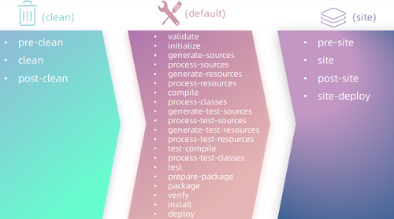

- [Maven](#maven)
  - [Maven 概述](#maven-概述)
      - [介绍](#介绍)
      - [模型](#模型)
      - [Maven 仓库](#maven-仓库)
  - [Maven 安装](#maven-安装)
  - [IDEA 集成 Maven](#idea-集成-maven)
      - [创建 Maven 项目](#创建-maven-项目)
      - [POM 配置详解](#pom-配置详解)
      - [Maven 坐标详解](#maven-坐标详解)
      - [导入 Maven 项目](#导入-maven-项目)
  - [依赖管理](#依赖管理)
      - [依赖配置](#依赖配置)
      - [依赖传递](#依赖传递)
      - [依赖范围](#依赖范围)
      - [生命周期](#生命周期)
  - [附录](#附录)
      - [更新依赖索引](#更新依赖索引)
      - [清理 maven 仓库](#清理-maven-仓库)

---

# Maven

## Maven 概述

#### 介绍

介绍：Maven 是 Apache 旗下的一个开源项目，是用于管理和构建 java 项目的工具

官网：https://maven.apache.org

作用：

1. 依赖管理
   - 方便快捷的管理项目依赖的资源 `.jar`
   - `pom.xml` 添加配置
2. 统一项目结构
   - 
3. 项目构建
   - 自动化项目构建方式

#### 模型


- `Build lifecycle & phases` 用来完成自动化项目构建流

- `Project Object Model` 将项目抽象成一个对象模型，有自己专属的坐标
  - 坐标就是 `.jar` 的唯一标识，通过坐标可以定位 `.jar` 文件位置
  - 
  - 

- `Dependency` 使用坐标描述当前项目依赖的第三方 `.jar`
  - 

#### Maven 仓库 

仓库：用于存储资源，管理各种 `.jar`

分为：

- 本地仓库：自己计算机上的一个目录
- 中央仓库：由 Maven 团队维护的全球唯一的，仓库[地址](https://repo1.maven.org/maven2)
- 远程仓库：一般由公司团队搭建的私有仓库 (私服)

当项目中使用坐标引入对应依赖 `.jar` 后，就依次在仓库中定位


## Maven 安装

下载地址：https://maven.apache.org/download.cgi

Maven 的文件结构：

* `bin`：可执行命令 `mvn`
* `conf`：Maven 的配置文件
* `lib`：Maven 依赖的 `.jar`

步骤：

1. 解压安装


2. 配置仓库

    ```xml
    # settings.xml


    <localRepository>C:\e\apache-maven-3.9.6\repo</localRepository>

    # 只可配置一个 <mirror>，不然会冲突
    <mirror>
    <id>alimaven</id>
        <name>aliyun maven</name>
        <url>http://maven.aliyun.com/nexus/content/groups/public/</url>
        <mirrorOf>central</mirrorOf>
    </mirror>
    ```

3. 配置 Maven 环境变量
   - `mvn -v` 验证

## IDEA 集成 Maven


```
# 1. 

All settings -> Build,Execution,Deployment  ->  Build Tools  ->  Maven
    Maven home path:
    User settings file:
    Local repository:

---

# 2.

Maven ->  Runner
    JRE:

---

# 3. 

Build,Execution,Deployment  -> Compiler -> Java Compiler
    Project bytecode version:
```

#### 创建 Maven 项目

1. 创建一个空项目 
2. 创建 Modules，选择 Maven
3. 填写信息

#### POM 配置详解

```xml
# pom.xml

<?xml version="1.0" encoding="UTF-8"?>
<project xmlns=""
         xmlns:xsi=""
         xsi:schemaLocation="">

    <!-- POM 模型的版本 -->
    <!-- 虽然模型本身的版本很少改变，但它仍然是必不可少的 -->
    <modelVersion>4.0.0</modelVersion>

    <!-- 当前项目坐标 -->
    <groupId>com.itheima</groupId>
    <artifactId>maven_project1</artifactId>
    <version>1.0-SNAPSHOT</version>
    
    <!-- 打包方式 --> 
    <!-- 通常设置为 jar 或 war -->
    <packaging>jar</packaging>
 
</project>

<!-- <project> : pom 文件的根标签，表示当前 maven 项目 -->
```

#### Maven 坐标详解

作用：

* Maven 中的坐标是【资源的唯一标识】，通过坐标可以唯一定位资源位置
* 使用坐标来定义项目或引入项目中需要的依赖

组成：

* `groupId`：项目隶属组织名称
* `artifactId`：项目名称，通常是模块名称
* `version`：当前项目版本号

#### 导入 Maven 项目

1. 使用 Maven 面板
   - 右侧 Maven 面板，点击 `+` 号，选中对应项目的 `pom.xml` 文件
   - `View  =>  Appearance  =>  Tool Window Bars` 展示 Maven 面板


2. `File  =>  Project Structure  =>  Modules  =>  +  =>  Import Module`
   - 找到要导入工程的 `pom.xml`

## 依赖管理

#### 依赖配置

在 `maven` 工程的 `pom.xml` 文件中，引入依赖

1. 在 `pom.xml` 中编写 `<dependencies>` 标签
2. 在 `<dependencies>` 标签中使用 `<dependency>` 引入坐标
3. 填写 `groupId、artifactId、version`
4. 点击刷新按钮
   - 

```xml
<dependencies>
    <!-- 第1个依赖 : logback -->
    <dependency>
        <groupId>ch.qos.logback</groupId>
        <artifactId>logback-classic</artifactId>
        <version>1.2.11</version>
    </dependency>
    <!-- 第2个依赖 : junit -->
    <dependency>
        <groupId>junit</groupId>
        <artifactId>junit</artifactId>
        <version>4.12</version>
    </dependency>
</dependencies>
```

注意事项：

1. 引入的依赖在本地仓库中不存在，将会连接 “远程仓库 / 中央仓库” 下载依赖
2. 依赖的坐标信息
   1. 可以到 mvn 的中央仓库 : https://mvnrepository.com 中搜索
   2. `Alt + Insert` 可以弹出 IDAE 内置的依赖搜索框

#### 依赖传递

Maven 默认接收传递依赖

依赖传递分为

1. 直接依赖：在当前项目中通过依赖配置建立的依赖关系
2. 间接依赖：被依赖的资源如果依赖其他资源，当前项目间接依赖其他资源

排除依赖：主动断开依赖的资源

```xml
<dependency>
    <groupId>com.itheima</groupId>
    <artifactId>maven-projectB</artifactId>
    <version>1.0-SNAPSHOT</version>
   
    <!-- 排除依赖 -->
    <exclusions>
    	<exclusion>
            <!-- 被排除的资源无需指定版本 -->
            <groupId>junit</groupId>
            <artifactId>junit</artifactId>
        </exclusion>
    </exclusions>
</dependency>
```

#### 依赖范围

作用范围：

1. 主程序范围有效 `main`
2. 测试程序范围有效 `test`
3. 是否参与打包运行 `package 指令`

在项目中导入依赖的 `.jar` 后，默认情况下，可以在任何地方使用

如果希望限制依赖的使用范围，可以通过 `<scope>` 标签设置其作用范围

==scope 标签==

- 取值范围

    | **scope**       | **main** | **test** | **package** |
    | --------------- | -------- | -------- | ----------- |
    | compile（默认） | Y        | Y        | Y           |
    | test            | -        | Y        | -           |
    | provided        | Y        | Y        | -           |
    | runtime         | -        | Y        | Y           |

- 示例代码

    ```xml
    <dependency>
        <scope></scope>
    </dependency>
    ```

#### 生命周期

Maven 的生命周期：描述了一次项目构建，经历的阶段

Maven 对项目构建的生命周期划分为 3 套（相互独立）

- `clean`：清理工作
- `default`：核心工作，如：编译、测试、打包、安装、部署等
- `site`：生成报告、发布站点等

3 套生命周期包含的具体阶段

- 

主要关注以下几个

- clean
  - clean：移除上一次构建生成的文件
- default
  - compile：编译项目源代码
  - test：使用合适的单元测试框架运行测试 `junit`
  - package：将编译后的文件打包
  - install：安装项目到本地仓库

IDEA 右侧的 maven 面板中，已给出快速访问通道

- `project -> Lifecycle`


在==同一套==生命周期中，我们在执行后面的生命周期时，前面的生命周期都会默认执行

> 当运行 `package` 时，`clean、compile` 生命周期会不会运行
> `clean` 不会运行，`compile`会运行

Maven 的生命周期是抽象的，这意味着生命周期本身不做任何实际工作，实际任务都交由插件来完成

## 附录

#### 更新依赖索引

有时候给 idea 配置完 maven 仓库信息后，在 idea 中依然搜索不到仓库中的 jar 包

这是因为仓库中的 jar 包索引尚未更新到 idea 中

这个时候我们就需要更新 idea 中 maven 的索引了，具体做法如下：

- `打开设置 -> 搜索maven -> Repositories -> 选中本地仓库 -> 点击 Update`

#### 清理 maven 仓库

初始情况下，本地仓库是没有任何 jar 包的，此时会从中央仓库去下载，可能由于网络的原因，jar 包下载不完全，这些不完整的 jar 包都是以 `.lastUpdated` 结尾

此时，maven 不会再重新帮你下载，需要你删除这些以 lastUpdated 结尾的文件，然后 maven 才会再次自动下载这些 jar 包

如果本地仓库中有很多这样的以 lastUpadted 结尾的文件，可以定义一个批处理文件，在其中编写如下脚本来删除： 

~~~bat
// .bat
// 文件内容如下

set REPOSITORY_PATH=E:\develop\apache-maven-3.6.1\mvn_repo
rem 正在搜索...

del /s /q %REPOSITORY_PATH%\*.lastUpdated

rem 搜索完毕
pause
~~~
