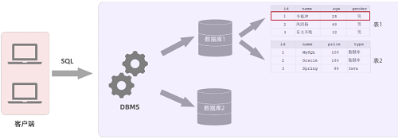
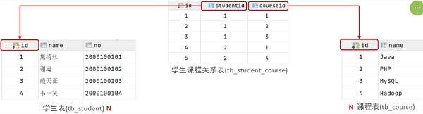
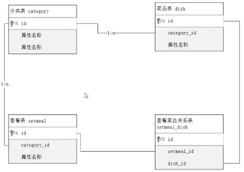
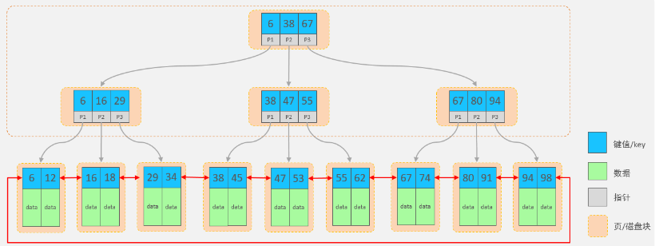

- [MySQL](#mysql)
  - [MySQL 简介](#mysql-简介)
      - [安装](#安装)
      - [数据模型](#数据模型)
      - [图形化工具](#图形化工具)
  - [SQL 简介](#sql-简介)
      - [通用语法](#通用语法)
      - [分类](#分类)
  - [DDL](#ddl)
      - [数据库操作](#数据库操作)
      - [表操作](#表操作)
      - [约束](#约束)
      - [数据类型](#数据类型)
      - [其他](#其他)
  - [DML](#dml)
      - [insert](#insert)
      - [update](#update)
      - [delete](#delete)
  - [DQL](#dql)
      - [语法](#语法)
      - [基本查询](#基本查询)
      - [条件查询](#条件查询)
      - [聚合函数](#聚合函数)
      - [分组查询](#分组查询)
      - [排序查询](#排序查询)
      - [分页查询](#分页查询)
      - [案例](#案例)
  - [多表设计](#多表设计)
      - [一对多](#一对多)
      - [多对多](#多对多)
      - [案例](#案例-1)
  - [多表查询](#多表查询)
      - [概述](#概述)
      - [内连接](#内连接)
      - [外连接](#外连接)
      - [子查询](#子查询)
  - [事务](#事务)
  - [索引](#索引)
      - [介绍](#介绍)
      - [结构](#结构)
      - [语法](#语法-1)

---

# MySQL

## MySQL 简介

结论：程序员给 `DBMS` 发送 `SQL` 语句操作数据

基于 “二维表” 存储数据的数据库就成为 “关系型”数据库

目前主流的数据库

- Oracle：大型的收费数据库，Oracle 公司产品，价格昂贵
- MySQL：开源免费的中小型数据库
- SQL Server：Microsoft 公司推出的收费的中型数据库，`C# .net` 等语言常用

课程内容安排：

- 数据库设计
- 数据库操作
- 数据库优化

#### 安装

官网：https://dev.mysql.com

官网下载地址：https://downloads.mysql.com/archives/community

==添加环境变量==

跟 Java 一样

验证

- 命令提示符（管理员）输入 `mysql`
- 返回 `Can't connect to MySQL server on 'localhost'`

==初始化 MySQL==

以管理员身份，运行命令行窗口

```
# 初始化
mysqld --initialize-insecure

# 注册
mysqld -install

# 启动
net start mysql

# 改密码
mysqladmin -u root password [...]
```

==连接==

MySQL 服务器启动完毕后，使用如下指令，来连接 MySQL 服务器

```
mysql -u[username] -p[password] -h[ip] -P[port]

// -h 默认是 127.0.0.1
// -P 默认是 3306
```

#### 数据模型

MySQL是关系型数据库，是基于二维表进行数据存储的，具体的结构图下:



数据库存在 `data` 文件夹下

#### 图形化工具

DataGrip 是 JetBrains 旗下的一款数据库管理工具，是管理和开发 MySQL 的理想解决方案

官网： https://www.jetbrains.com/zh-cn/datagrip

说明：DataGrip 这款工具可以不用安装，这款工具的功能已经集成到了 IDEA 当中

使用：`Data Source -> MySQL ->"Name Comment Host Port User Password"`

## SQL 简介

SQL：结构化查询语言，操作关系型数据库的编程语言，操作所有关系型数据库的统一标准

#### 通用语法

1. SQL 语句以分号结尾
2. MySQL 数据库的 SQL 语句不区分大小写
3. 注释
   - 单行注释：`--`
   - 多行注释：`/* */`

#### 分类

| 分类 | 全称                        | 说明               |
| ---- | --------------------------- | ------------------ |
| DDL  | Data Definition  Language   | 数据定义语言       |
| DML  | Data Manipulation  Language | 数据操作语言       |
| DQL  | Data Query Language         | 数据查询语言       |
| DCL  | Data Control  Language      | 数据控制语言，权限 |

针对于数据库来说，主要包括三个阶段：

1. 数据库设计阶段
   - 参照页面原型以及需求文档设计数据库表结构
2. 数据库操作阶段
   - 根据业务功能的实现，编写 SQL 语句对数据表中的数据进行增删改查操作
3. 数据库优化阶段
   - 优化手段：索引、SQL 优化、分库分表等

## DDL

数据定义

#### 数据库操作

```sql
-- 使用数据库
-- 我们要操作某一个数据库，必须要切换到对应的数据库中

use 'name';
```

```sql
-- 查询所有数据库

show databases;
show schemas;
```

```sql
-- 查询当前数据库

select database();
```

```sql
-- 创建数据库

create database [if not exists] 'name';
```

```sql
-- 删除数据库

drop database [if exists] 'name';
```

上述语法中的 `database`，可以替换成 `schema`

#### 表操作

```sql
-- 创建

create table 'name'(
	'name1'  int [约束]  [comment],
	'name2'  int [约束]  [comment],
	...
	'name3'  int [约束]  [comment]
) [comment] ;
```

```sql
-- 例子

create table tb_user (
    id    int primary key auto_increment comment 'ID,唯一标识',
    uname varchar(20) not null unique comment '用户名',
    name  varchar(10) not null comment '姓名',
    age   int comment '年龄',
    ger   char(1) default '男' comment '性别'
) comment '用户表';
```

#### 约束

概念：所谓约束就是作用在表中字段上的规则，用于限制存储在表中的数据

作用：就是来保证数据库当中数据的正确性、有效性和完整性

在 MySQL 数据库当中，提供了以下5种约束：

| 约束     | 描述                                             | 关键字      |
| -------- | ------------------------------------------------ | ----------- |
| 主键约束 | 主键是一行数据的唯一标识，要求非空且唯一         | primary key |
| 非空约束 | 限制该字段值不能为 null                          | not null    |
| 唯一约束 | 保证字段的所有数据都是唯一                       | unique      |
| 默认约束 | 保存数据时，如果未指定该字段值，则采用默认值     | default     |
| 外键约束 | 让两张表的数据建立连接，保证数据的一致性和完整性 | foreign key |

`auto_increment`

- 每次插入新的行记录时，数据库自动生成 id 字段(主键)下的值
- 具有 `auto_increment` 的数据列是一个正数序列从 1 开始增长

#### 数据类型

主要分为三类：数值类型 字符串类型 日期时间类型

数值类型

| 类型        | 大小   | 有符号(SIGNED)范围                                    | 无符号(UNSIGNED)范围                                       | 描述               |
| ----------- | ------ | ----------------------------------------------------- | ---------------------------------------------------------- | ------------------ |
| TINYINT     | 1byte  | (-128，127)                                           | (0，255)                                                   | 小整数值           |
| SMALLINT    | 2bytes | (-32768，32767)                                       | (0，65535)                                                 | 大整数值           |
| MEDIUMINT   | 3bytes | (-8388608，8388607)                                   | (0，16777215)                                              | 大整数值           |
| INT/INTEGER | 4bytes | (-2147483648，2147483647)                             | (0，4294967295)                                            | 大整数值           |
| BIGINT      | 8bytes | (-2^63，2^63-1)                                       | (0，2^64-1)                                                | 极大整数值         |
| FLOAT       | 4bytes | (-3.402823466 E+38，3.402823466351 E+38)              | 0 和 (1.175494351  E-38，3.402823466 E+38)                 | 单精度浮点数值     |
| DOUBLE      | 8bytes | (-1.7976931348623157 E+308，1.7976931348623157 E+308) | 0 和  (2.2250738585072014 E-308，1.7976931348623157 E+308) | 双精度浮点数值     |
| DECIMAL     |        | 依赖于M(精度)和D(标度)的值                            | 依赖于M(精度)和D(标度)的值                                 | 小数值(精确定点数) |

字符串类型

| 类型       | 大小                  | 描述                         |
| ---------- | --------------------- | ---------------------------- |
| CHAR       | 0-255 bytes           | 定长字符串(需要指定长度)     |
| VARCHAR    | 0-65535 bytes         | 变长字符串(需要指定长度)     |
| TINYBLOB   | 0-255 bytes           | 不超过255个字符的二进制数据  |
| TINYTEXT   | 0-255 bytes           | 短文本字符串                 |
| BLOB       | 0-65 535 bytes        | 二进制形式的长文本数据       |
| TEXT       | 0-65 535 bytes        | 长文本数据                   |
| MEDIUMBLOB | 0-16 777 215 bytes    | 二进制形式的中等长度文本数据 |
| MEDIUMTEXT | 0-16 777 215 bytes    | 中等长度文本数据             |
| LONGBLOB   | 0-4 294 967 295 bytes | 二进制形式的极大文本数据     |
| LONGTEXT   | 0-4 294 967 295 bytes | 极大文本数据                 |

char 是定长字符串，指定长度多长，就占用多少个字符，和字段值的长度无关

而 varchar 是变长字符串，指定的长度为最大占用长度，相对来说，char 的性能会更高些

日期时间类型

| 类型      | 大小 | 范围                                       | 格式                | 描述                     |
| --------- | ---- | ------------------------------------------ | ------------------- | ------------------------ |
| DATE      | 3    | 1000-01-01 至  9999-12-31                  | YYYY-MM-DD          | 日期值                   |
| TIME      | 3    | -838:59:59 至  838:59:59                   | HH:MM:SS            | 时间值或持续时间         |
| YEAR      | 1    | 1901 至 2155                               | YYYY                | 年份值                   |
| DATETIME  | 8    | 1000-01-01 00:00:00 至 9999-12-31 23:59:59 | YYYY-MM-DD HH:MM:SS | 混合日期和时间值         |
| TIMESTAMP | 4    | 1970-01-01 00:00:01 至 2038-01-19 03:14:07 | YYYY-MM-DD HH:MM:SS | 混合日期和时间值，时间戳 |

#### 其他

```sql
表结构

-- 查看指定表结构
desc 'tb_name';

-- 查询指定表的建表语句
show create table 'tb_name';

+++++

修改字段

1. 图形化方式：Modify Table  ->  +/-  ->  execute

2. 

-- 添加字段
alter table 'tb_name' add  'name1  int [约束]  [comment]';

-- 修改数据类型
alter table 'tb_name' modify  'name1' ...;

-- 删除字段
alter table 表名 drop 'name1';

+++++

修改表名

1. rename
2. rename table 'tb_name' to  'tb_name_new';

+++++

删除表

1. drop
2. drop table [if exists]  'tb_name';
```

## DML

对数据库中表的数据记录进行

- 添加 INSERT
- 修改 UPDATE
- 删除 DELETE 

#### insert

向指定字段添加数据
- `insert into 表名 (字段1, 字段2) values (值1, 值2);`

全部字段添加数据
- `insert into 表名 values (值1, 值2, ...);`

批量添加数据（指定字段）
- `insert into 表名 (字段名1, 字段名2) values (值1, 值2), (值1, 值2);`

批量添加数据（全部字段）
- `insert into 表名 values (值1, 值2, ...), (值1, 值2, ...);`

例子：批量向 tb_emp 表的 `username name gender` 字段插入数据

~~~sql
insert into tb_emp(username, name, gender, create_time, update_time)
values ('x', 'xx', 1, now(), now()),
       ('y', 'yy', 1, now(), now());
~~~

注意事项：

1. 插入数据时，指定的字段顺序需要与值的顺序是一一对应的
2. 字符串和日期型数据应该包含在引号中
3. 插入的数据大小，应该在字段的规定范围内

#### update

语法：
- `update 'tablename' set 字段名1 = 值1 , 字段名2 = 值2 , .... [where condition];`

例子：将 tb_emp 表中 id 为 1 的员工，姓名 name 字段更新为 '张三'
- `update tb_emp set name='张三',update_time=now() where id=1;`

注意事项:
1. 修改语句的条件可以有，也可以没有，如果没有条件，则会修改整张表的所有数据
2. 在修改数据时，一般需要同时修改公共字段 `update_time`，将其修改为当前操作时间


#### delete

语法：
- `delete from 'tablename' [where condition];`

案例1：删除 tb_emp 表中 id 为 1 的员工
- `delete from tb_emp where id = 1;`


注意事项:
1. DELETE 语句的条件可以有，也可以没有，如果没有条件，则会删除整张表的所有数据
2. DELETE 语句不能删除某一个字段的值
   - 使用 UPDATE，将该字段值置为 NULL 即可达到效果
3. 当进行删除全部数据操作时，直接点击 Execute 确定执行

## DQL

查询数据库表中的记录

查询关键字：SELECT

在一个正常的业务系统中，查询操作的使用频次是要远高于增删改操作的

#### 语法

语法结构如下：

```mysql
SELECT
	列
FROM
	表
WHERE
	条件
GROUP BY
	分组字段列表
HAVING
	分组后条件列表
ORDER BY
	排序字段列表
LIMIT
	分页参数
```

#### 基本查询

不带任何的查询条件

查询多个字段
- `select [column] from [table];`

查询所有字段（通配符）
- `select *  from  [table];`

去除重复记录
- `select distinct [column] from  [table];`

设置别名
- 查询结果以别名显示
- `select [column as 别名] from [table];`
- `select name AS 姓名, entrydate AS 入职日期 from tb_emp`

#### 条件查询

```sql
select [column] from [table] where [condition];
```

在 SQL 语句当中构造条件的运算符分为两类：

- 比较运算符
- 逻辑运算符

==比较运算符==

| **比较运算符**       | **功能**                                       |
| -------------------- | ---------------------------------------------- |
| > >=  <     <=   =   | 大于小于                                       |
| <> 或 !=             | 不等于                                         |
| between ...  and ... | 在某个范围之内(含最小、最大值)                 |
| in(...)              | 在 in 之后的列表中的值，多选一                 |
| like 占位符          | 模糊匹配( `_` 匹配单个字符, `%`匹配任意个字符) |
| is null              | 是 null                                        |
| is not null          | 不是 null                                      |

==逻辑运算符==

| **逻辑运算符** | **功能**                    |
| -------------- | --------------------------- |
| and 或 &&      | 并且 (多个条件同时成立)     |
| or 或 \|\|     | 或者 (多个条件任意一个成立) |
| not 或 !       | 非 , 不是                   |

#### 聚合函数

注意：聚合函数会忽略空值，对 NULL 值不进行统计

常用聚合函数：

| **函数** | **功能** |
| -------- | -------- |
| count    | 统计数量 |
| max      | 最大值   |
| min      | 最小值   |
| avg      | 平均值   |
| sum      | 求和     |

#### 分组查询

分组：根据指定列的数据进行分组

语法：

~~~sql
select [column] from [table] where [condition] group by [...] having [condition];
~~~

执行顺序：`where -> 聚合函数 -> having` 

where 与 having 区别

- 执行时机不同
  - where 是分组之前进行过滤，不满足 where 条件，不参与分组
  - having 是分组之后对结果进行过滤
- 判断条件不同
  - where 不能对聚合函数进行判断，而 having 可以

#### 排序查询

语法：

```mysql
order by [column] [ASC/DESC];
```

#### 分页查询

语法：

```sql
limit [begin_index, number];

-- 从起始索引 0 开始计数
-- 分页查询是数据库的方言，MySQL 中是 LIMIT
-- 第一页数据，begin_index 可以省略
```

#### 案例

`count` 查询入职时间在 '2015-01-01' 以前的员工，并对结果根据职位分组，获取员工数量大于等于 2 的职位

~~~mysql
select job, count(*)
from tb_emp
where entrydate <= '2015-01-01'   -- 分组前条件
group by job                      -- 按照job字段分组
having count(*) >= 2;             -- 分组后条件
~~~

`limit` 查询 “第 2 页” 员工数据，每页展示 5 条记录

~~~mysql
select *
from tb_emp
limit 5 , 5; -- 从索引 5 开始，向后取 5 条记录
~~~

```sql
select *
from tb_emp
where 
  name like '张%' and 
  gender = 1 and 
  entrydate between '2000-01-01' and '2015-12-31'
order by update_time desc
limit 0 , 10;
```

`case` 查询各职位的人数

~~~sql
select (case job
             when 1 then '班主任'
             when 2 then '讲师'
             when 3 then '学工主管'
             when 4 then '教研主管'
             else '未分配职位'
        end) AS 职位 ,
       count(*) AS 人数
from tb_emp
group by job;
~~~

`if` 查询各性别的人数

~~~mysql
select if(gender=1,'男','女') AS 性别, count(*) AS 人数
from tb_emp
group by gender;
~~~

## 多表设计

#### 一对多

数据库中的 “外键约束” 来解决

对应的关键字：`foreign key`


```sql
-- 创建表时指定
create table 表名(
	字段名    数据类型,
	...
	[constraint] [constraint_name] foreign key ([column]) references [table] ([column])	
);


-- 建完表后，添加外键
alter table [table_name]
add constraint [constraint_name] foreign key([column]) references [table]([column]);
```

图形化界面操作

`modify table -> foreign keys`

缺点：
- 影响增、删、改的效率（需要检查外键关系）
- 仅用于单节点数据库，不适用与分布式、集群场景
- 容易引发数据库的死锁问题，消耗性能

在现在的企业开发中，很少会使用 `foreign key`，都是使用逻辑外键，即在后端代码中保证

#### 多对多

关系：一个学生可以选修多门课程，一门课程也可以供多个学生选择
实现关系：建立第三张中间表，中间表至少包含两个外键，分别关联两方主键



~~~sql
-- 学生课程表（中间表）
create table tb_student_course(
   id int auto_increment primary key,
   student_id int not null ,
   course_id  int not null ,
   constraint fk_courseid foreign key (course_id) references tb_course (id),
   constraint fk_studentid foreign key (student_id) references tb_student (id)
);
~~~

IDEA 数据关系可视化 `diagrams -> show visualization`

#### 案例

页面原型-分类

- 分类的信息：分类名称、分类类型[菜品/套餐]、分类排序、分类状态[禁用/启用]、分类的操作时间

页面原型-菜品

- 菜品的信息：菜品名称、菜品图片、菜品分类、菜品售价、菜品售卖状态、菜品的操作时间

页面原型-套餐
- 套餐的信息：套餐名称、套餐图片、套餐分类、套餐价格、套餐售卖状态、套餐的操作时间

关系

- 一个 “分类” 下会有多个 “菜品”，而一个 “菜品” 只能归属一个 “分类”
- 一个 “分类” 下会有多个 “套餐”，而一个 “套餐” 只能归属一个 “分类”
- 一个 “套餐” 下会有多个 “菜品”，而一个 “菜品” 也可以出现在多个 “套餐” 中




## 多表查询

#### 概述

多表查询：查询时从多张表中获取所需数据

在多表查询时，需要消除无效的笛卡尔积，只保留表关联部分的数据

~~~sql
-- 笛卡尔积 两个集合的所有组合情况

select * from [tableList 1, 2...];
~~~

在 SQL 语句中，只需要给多表查询加上连接查询的条件即可

~~~sql
select * from [tableList 1, 2...] where tb1.id = tb2.id;
~~~

多表查询可以分为

1. 连接查询
   - 内连接：相当于查询 A、B 交集部分数据
   - 

2. 外连接
   - 左外连接：查询左表所有数据 (包括两张表交集部分数据)
   - 右外连接：查询右表所有数据 (包括两张表交集部分数据)

3. 子查询


#### 内连接

内连接查询：查询两表或多表中 “交集” 部分数据

内连接从语法上可以分为：

- 隐式内连接
- 显式内连接

隐式内连接语法：

``` sql
select [c] from [tbList] where [condition];
```

显式内连接语法：

``` sql
select [c] from [tb1] [inner] join [tb2] on [condition];
```

案例：查询员工的姓名及所属的部门名称

- 隐式内连接实现

   ~~~sql
   select tb_emp.name , tb_dept.name   -- 分别查询两张表中的数据
   from tb_emp , tb_dept               -- 关联两张表
   where tb_emp.dept_id = tb_dept.id;  -- 消除笛卡尔积
   ~~~

- 显式内连接实现

   ~~~sql
   select tb_emp.name , tb_dept.name
   from tb_emp inner join tb_dept
   on tb_emp.dept_id = tb_dept.id;
   ~~~


多表查询时可以给表起别名，方便代码书写

使用了别名的多表查询：

~~~sql
select emp.name , dept.name
from tb_emp emp inner join tb_dept dept
on emp.dept_id = dept.id;

-- 一旦为表起了别名，就不能再使用表名来指定对应的字段了，此时只能够使用别名来指定字段
~~~

#### 外连接

外连接分为两种：左外连接 和 右外连接

左外连接

- 相当于 “左表” 的所有数据，包含 “左表” 和 “右表” 交集部分的数据
- 语法结构：
- `select [c] from [tb1] left [outer] join [tb2] on [condition];`

右外连接

- 相当于 “右表” 的所有数据，包含 “左表” 和 “右表” 交集部分的数据
- 语法结构：
- `select [c] from [tb1] right [outer] join [tb2] on [condition];`

#### 子查询

SQL 语句中嵌套 select 语句，称为嵌套查询，又称子查询

```sql
SELECT [] FROM [] WHERE column1 = (SELECT [] FROM ...);
```

子查询外部的语句可以是 `insert/update/delete/select` 的任何一个，最常见的是 `select`

根据子查询结果的不同分为：

1. 标量子查询（子查询结果为单个值）
2. 列子查询（子查询结果为一列，但可以是多行）
3. 行子查询（子查询结果为一行，但可以是多列）
4. 表子查询（子查询结果为多行多列，相当于子查询结果是一张表）

子查询可以书写的位置：

1. where 之后
2. from 之后
3. select 之后

==标量子查询==

子查询返回的结果是单个值

常用的操作符： `=   <>   >    >=    <   <=`  

案例：查询 "教研部" 的所有员工信息

```sql
-- 1. 查询 "教研部" 部门 ID
select id from tb_dept where name = '教研部';
-- 2. 根据 "教研部" 部门 ID，查询员工信息
select * from tb_emp where dept_id = 2;

-- 合并出上两条 SQL 语句
select * 
from tb_emp 
where dept_id = (select id from tb_dept where name = '教研部');
```

==列子查询==

子查询返回的结果是一列

常用的操作符：`in、not in`

案例：查询 "教研部" 和 "咨询部" 的所有员工信息

```sql
-- 1. 查询 "销售部" 和 "市场部" 的部门 ID
select id from tb_dept where name = '教研部' or name = '咨询部';
-- 2. 根据部门 ID, 查询员工信息
select * from tb_emp where dept_id in (3,2);

-- 合并以上两条 SQL 语句
select * 
from tb_emp
where dept_id in (select id from tb_dept where name = '教研部' or name = '咨询部');
```

==行子查询==

子查询返回的结果是一行

常用的操作符：`= 、<> 、IN 、NOT IN`

案例：查询与 "韦一笑" 的入职日期及职位都相同的员工信息 

```sql
-- 查询 "韦一笑" 的 “入职日期” 及 “职位”
select entrydate, job from tb_emp where name = '韦一笑';
-- 查询与"韦一笑"的入职日期及职位相同的员工信息
select * from tb_emp where (entrydate,job) = ('2007-01-01',2);

-- 合并以上两条 SQL 语句
select * 
from tb_emp 
where (entrydate,job) = (select entrydate , job from tb_emp where name = '韦一笑');
```

==表子查询==

子查询返回的结果是多行多列，常作为临时表

案例：查询入职日期是 "2006-01-01" 之后的员工信息，及其部门信息

~~~sql
select e.*, d.* 
from (select * from emp where entrydate > '2006-01-01') e 
         left join dept d on e.dept_id = d.id ;
~~~

## 事务

事务是一组操作的集合，是一个不可分割的工作单位，这些操作要么同时成功，要么同时失败

MYSQL 中有两种方式进行事务的操作：

1. 自动提交事务：即执行一条 sql 语句提交一次事务
2. 手动提交事务：先开启，再提交 

事务操作有关的SQL语句：

| SQL 语句                    | 描述             |
| --------------------------- | ---------------- |
| `start transaction;/begin;` | 开启手动控制事务 |
| `commit;`                   | 提交事务         |
| `rollback;`                 | 回滚事务         |

```sql
-- 1. 成功
begin;
...
commit;

-- 2. 失败
begin;
...
rollback;
```

例子：使用事务控制删除部门和删除该部门下的员工

```sql
-- 1.

-- 开启事务
start transaction;
-- 删除学工部
delete from tb_dept where id = 1;
-- 删除学工部的员工
delete from tb_emp where dept_id = 1;
```

```sql
-- "1." 这组 SQL 语句执行成功，则提交事务
commit;
```

```sql
-- "1." 这组 SQL 语句执行失败，则回滚事务
rollback;
```

==四大特性==

- 原子性（Atomicity）：要么全部成功，要么全部失败
- 一致性（Consistency）：事务完成时，必须使所有的数据都保持一致状态
- 隔离性（Isolation）：多个用户并发的访问数据库时，一个用户的事务不能被其他用户的事务干扰，多个并发的事务之间要相互隔离
- 持久性（Durability）：事务一旦提交或回滚，它对数据库中的数据的改变就是永久的

事务的四大特性简称为：ACID

## 索引

#### 介绍 

索引 index ：帮助数据库高效获取数据的数据结构

优点：

1. 提高数据查询的效率
2. 降低数据排序的成本，因为在建立索引时用的是一些方便排序的数据结构

缺点：

1. 索引会占用存储空间
2. 降低了 `insert、update、delete` 的效率

#### 结构

MySQL 数据库支持的索引结构有很多，如：`Hash`、`B+Tree`、`Full-Text` 等

如果没有特别指明，默认指的 `B+Tree` 结构组织的索引

思考：采用 “二叉搜索树” 或者 “红黑树” 来作为索引的结构有什么问题？

答案：在数据量大的情况下，树的层级比较深，不适合磁盘操作




#### 语法

==创建索引==

~~~sql
create [unique] index [name] on [tableName]([column]);
~~~

~~~sql
-- 为 tb_emp 表的 name 字段建立一个索引

create index idx_emp_name on tb_emp(name);
~~~

`primary key` `unique` 关键字会默认创建 “主键索引” “唯一索引”

==查看索引==

~~~sql
show index from [tableName];
~~~

==删除索引==

~~~sql
drop index [name] on [tableName];
~~~
