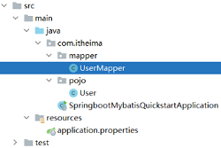
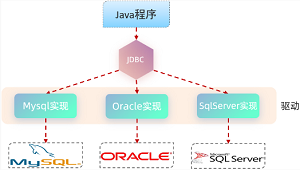

- [Mybatis](#mybatis)
  - [前言](#前言)
  - [快速入门](#快速入门)
      - [准备工作](#准备工作)
      - [mapper](#mapper)
      - [单元测试](#单元测试)
      - [SQL 填充](#sql-填充)
  - [JDBC](#jdbc)
  - [数据库连接池](#数据库连接池)
  - [lombok](#lombok)

---

# Mybatis

## 前言

Java 程序操作数据库的主流的方式是 `Mybatis`

- 优秀的 “持久层框架”，用于简化 JDBC 的开发
- MyBatis 本是 Apache 的一个开源项目 iBatis，2010 年这个项目由 apache 迁移到了google code，并且改名为 MyBatis，2013年11月迁移到 Github

在上面我们提到了两个词：一个是持久层，另一个是框架

- 持久层：指的是就是数据访问层 `dao`，是用来操作数据库的
- 框架：是一个半成品软件，是一套可重用的、通用的、软件基础代码模型

## 快速入门

对 Mybatis 来说，在开发持久层程序操作数据库时，需要重点关注以下两个方面：

1. application.properties
2. Mapper 接口

#### 准备工作

==创建springboot工程==

- 导入 `MyBatis Framework` `MySQL Driver`
- `SQL -> MyBatis Framework & MySQL Driver`

~~~xml
<!-- 仅供参考：只粘贴了 pom.xml 中部分内容 -->
<dependencies>
        <!-- mybatis 起步依赖 -->
        <dependency>
            <groupId>org.mybatis.spring.boot</groupId>
            <artifactId>mybatis-spring-boot-starter</artifactId>
            <version>2.3.0</version>
        </dependency>

        <!-- mysql 驱动包依赖 -->
        <dependency>
            <groupId>com.mysql</groupId>
            <artifactId>mysql-connector-j</artifactId>
            <scope>runtime</scope>
        </dependency>
</dependencies>
~~~

==数据准备==

创建用户表，并创建对应的实体类 User

==配置 Mybatis==

在 springboot 项目中，可以编写 `application.properties` 文件，配置数据库连接信息

```properties
file: application.properties

# 驱动类名称
spring.datasource.driver-class-name=com.mysql.cj.jdbc.Driver
# 数据库的 url
spring.datasource.url=jdbc:mysql://localhost:3306/xxx
# 用户名
spring.datasource.username=root
# 密码
spring.datasource.password=1234
```

#### mapper

在 mapper 包下创建一个接口 UserMapper ，这是一个持久层接口

Mybatis 的持久层接口规范一般都叫 `XxxMapper`



~~~java
// UserMapper

import com.itheima.pojo.User;
import org.apache.ibatis.annotations.Mapper;
import org.apache.ibatis.annotations.Select;
import java.util.List;

@Mapper
public interface UserMapper {
    // 查询所有用户数据
    @Select("select * from user")
    public List<User> list();
    
}
~~~

`@Mapper`
- 表示是 mybatis 中的 Mapper 接口
- 程序运行时，框架会自动生成接口的实现类对象(代理对象)，并给交 Spring 的 IOC 容器管理

`@Select`
- 代表 `select` 查询

#### 单元测试

在 src 下的 test 目录下，已经自动帮我们创建好了测试类，并且在测试类上已经添加了注解 `@SpringBootTest`，代表该测试类已经与 SpringBoot 整合

该测试类在运行时，会自动通过引导类加载 Spring 的环境（IOC容器）

我们要测试那个 bean 对象，就可以直接通过 `@Autowired` 注解直接将其注入，然后进行测试

测试类代码如下： 

```java
@SpringBootTest
public class MybatisQuickstartApplicationTests {
	
    @Autowired
    private UserMapper userMapper;
	
    @Test
    public void testList(){
        List<User> userList = userMapper.list();
        for (User user : userList) {
            System.out.println(user);
        }
    }

}
```

#### SQL 填充

默认在 `@Select` 注解中编写 SQL 语句是没有提示的

关键字有填充

- 右击 `@Select` 中的 SQL 语句，`Show Context Actions -> Inject language or reference -> MySQL`


别表名等有填充

- Idea 和数据库建立起连接
- `Database -> + -> Data Sourece -> ...`

## JDBC

Mybatis 框架是对原始的 JDBC 程序的封装 

JDBC `Java DataBase Connectivity` 是使用 Java 语言操作关系型数据库的一套 API



本质：
- sun 公司官方定义的一套操作所有关系型数据库的规范，即 JDBC 接口
- 各个数据库厂商去实现这套接口，提供数据库驱动 jar 包
- 我们可以使用这套接口编程，真正执行的代码是驱动 jar 包中的实现类


```java
// JDBC 具体代码使用
import ...;

public class JdbcTest {
    @Test
    public void testJdbc() throws Exception {
        // 1. 注册驱动
        Class.forName("com.mysql.cj.jdbc.Driver");

        // 2. 获取数据库连接
        String url="jdbc:mysql://127.0.0.1:3306/mybatis";
        String username = "root";
        String password = "1234";
        Connection connection = DriverManager.getConnection(url, username, password);

        // 3. 执行SQL
        Statement statement = connection.createStatement(); //操作SQL的对象
        String sql="select id,name,age,gender,phone from user";
        ResultSet rs = statement.executeQuery(sql);//SQL查询结果会封装在ResultSet对象中

        List<User> userList = new ArrayList<>();//集合对象（用于存储User对象）
        // 4. 处理 SQL 执行结果
        while (rs.next()){
            //取出一行记录中id、name、age、gender、phone下的数据
            int id = rs.getInt("id");
            String name = rs.getString("name");
            short age = rs.getShort("age");
            short gender = rs.getShort("gender");
            String phone = rs.getString("phone");
            //把一行记录中的数据，封装到User对象中
            User user = new User(id,name,age,gender,phone);
            userList.add(user);//User对象添加到集合
        }

        // 5. 释放资源
        statement.close();
        connection.close();
        rs.close();

        // 控制台打印获取到的结果
        for (User user : userList) {
            System.out.println(user);
        }
    }
}
```


## 数据库连接池

Mybatis 使用了 “数据库连接池技术”，避免频繁的创建连接、销毁连接而带来的资源浪费 （上节代码的 `// 5. `）

没有使用数据库连接池：

- 客户端执行 SQL 语句要先创建一个新的连接对象，然后执行 SQL 语句，SQL 语句执行后又需要关闭连接对象从而释放资源
- 每次执行 SQL 时都需要创建连接、销毁链接，这种频繁的重复创建销毁的过程是比较耗费计算机的性能

数据库连接池是个容器，负责分配、管理数据库连接

- 程序在启动时，会在数据库连接池(容器)中，创建一定数量的 `Connection` 对象
- 允许应用程序重复使用一个现有的数据库连接，而不是再重新建立一个
- 客户端在执行 SQL 时，先从连接池中获取一个 `Connection` 对象，然后在执行 SQL 语句，SQL 语句执行完之后，释放 `Connection` 时只是把 `Connection` 对象归还给连接池
- 释放空闲时间超过最大空闲时间的连接，来避免因为没有释放连接而引起的数据库连接遗漏

数据库连接池的好处：

1. 资源重用
2. 提升系统响应速度
3. 避免数据库连接遗漏

官方(sun)提供了数据库连接池标准（ `javax.sql.DataSource` 接口 ）
  - 功能：获取连接 
    ~~~java
    public Connection getConnection() throws SQLException;
    ~~~
  - 第三方组织必须按照 `DataSource` 接口实现

常见的数据库连接池：

* C3P0
* DBCP
* Druid
* Hikari (springboot默认)

切换为 Druid 数据库连接池，操作如下：

- 参考官方地址：https://github.com/alibaba/druid/tree/master/druid-spring-boot-starter

## lombok

==介绍==

Lombok是一个实用的 Java 类库，通过注解来简化臃肿的 Java 代码

通过注解自动生成 `构造器 getter/setter equals hashcode toString` 等方法，并可以自动化生成日志变量

| **注解**            | **作用**                                                      |
| ------------------- | ------------------------------------------------------------- |
| @Getter/@Setter     | 为所有的属性提供 get/set 方法                                 |
| @ToString           | 会给类自动生成易阅读的  toString 方法                         |
| @EqualsAndHashCode  | 根据类所拥有的非静态字段自动重写 equals 方法和  hashCode 方法 |
| @Data               | @Getter  + @Setter + @ToString + @EqualsAndHashCode           |
| @NoArgsConstructor  | 无参的构造器                                                  |
| @AllArgsConstructor | 除了 static 修饰的字段之外带有各参数的构造器                  |

==使用==

第 1 步：在 pom.xml 文件中引入依赖

```xml
<!-- 在 springboot 的父工程中，已经集成了 lombok 并指定了版本号 -->
<!-- 故当前引入依赖时不需要指定 version -->

<dependency>
    <groupId>org.projectlombok</groupId>
    <artifactId>lombok</artifactId>
</dependency>
```

第 2 步：在实体类上添加注解

~~~java
import lombok.Data;

@Data   // getter方法、setter方法、toString方法、hashCode方法、equals方法
@NoArgsConstructor  // 无参构造
@AllArgsConstructor // 全参构造
public class User {
    private Integer id;
    private String name;
    private Short age;
    private Short gender;
    private String phone;
}
~~~

==注意事项==

- Lombok 会在编译时，会自动生成对应的 java 代码
- 使用 lombok 需要安装一个叫 `lombok` 的插件（ IDEA 自带）
