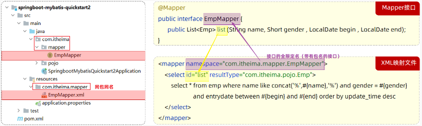
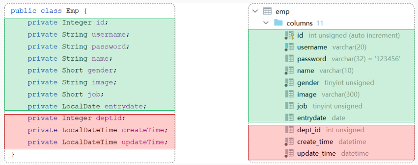

- [Mybatis](#mybatis)
  - [前言](#前言)
  - [快速入门](#快速入门)
      - [准备工作](#准备工作)
      - [mapper](#mapper)
      - [单元测试](#单元测试)
      - [SQL 填充](#sql-填充)
  - [JDBC](#jdbc)
  - [数据库连接池](#数据库连接池)
  - [Mybatis 的 XML 配置文件](#mybatis-的-xml-配置文件)
- [增删改查](#增删改查)
  - [日志输入](#日志输入)
  - [准备](#准备)
  - [删除](#删除)
      - [功能实现](#功能实现)
      - [参数占位符](#参数占位符)
  - [新增](#新增)
      - [基本新增](#基本新增)
      - [主键返回](#主键返回)
  - [更新](#更新)
  - [查询](#查询)
      - [数据封装](#数据封装)
      - [条件查询](#条件查询)
- [动态 SQL](#动态-sql)
  - [if](#if)
  - [foreach](#foreach)
  - [sql\&include](#sqlinclude)

---

# Mybatis

## 前言

Java 程序操作数据库的主流的方式是 `Mybatis`

- 优秀的 “持久层框架”，用于简化 JDBC 的开发
- MyBatis 本是 Apache 的一个开源项目 iBatis，2010 年这个项目由 apache 迁移到了google code，并且改名为 MyBatis，2013年11月迁移到 Github

在上面我们提到了两个词：一个是持久层，另一个是框架

- 持久层：指的是就是数据访问层 `dao`，是用来操作数据库的
- 框架：是一个半成品软件，是一套可重用的、通用的、软件基础代码模型

## 快速入门

对 Mybatis 来说，在开发持久层程序操作数据库时，需要重点关注以下两个方面：

1. application.properties
2. Mapper 接口

#### 准备工作

==创建springboot工程==

- 导入 `MyBatis Framework` `MySQL Driver`
- `SQL -> MyBatis Framework & MySQL Driver`

~~~xml
<!-- 仅供参考：只粘贴了 pom.xml 中部分内容 -->
<dependencies>
        <!-- mybatis 起步依赖 -->
        <dependency>
            <groupId>org.mybatis.spring.boot</groupId>
            <artifactId>mybatis-spring-boot-starter</artifactId>
            <version>2.3.0</version>
        </dependency>

        <!-- mysql 驱动包依赖 -->
        <dependency>
            <groupId>com.mysql</groupId>
            <artifactId>mysql-connector-j</artifactId>
            <scope>runtime</scope>
        </dependency>
</dependencies>
~~~

==数据准备==

创建用户表，并创建对应的实体类 User

==配置 Mybatis==

在 springboot 项目中，可以编写 `application.properties` 文件，配置数据库连接信息

```properties
file: application.properties

# 驱动类名称
spring.datasource.driver-class-name=com.mysql.cj.jdbc.Driver
# 数据库的 url
spring.datasource.url=jdbc:mysql://localhost:3306/xxx
# 用户名
spring.datasource.username=root
# 密码
spring.datasource.password=1234
```

#### mapper

在 mapper 包下创建一个接口 UserMapper ，这是一个持久层接口

Mybatis 的持久层接口规范一般都叫 `XxxMapper`


~~~java
// UserMapper

import com.itheima.pojo.User;
import org.apache.ibatis.annotations.Mapper;
import org.apache.ibatis.annotations.Select;
import java.util.List;

@Mapper
public interface UserMapper {
    // 查询所有用户数据
    @Select("select * from user")
    public List<User> list();
    
}
~~~

`@Mapper`
- 表示是 mybatis 中的 Mapper 接口
- 程序运行时，框架会自动生成接口的实现类对象(代理对象)，并给交 Spring 的 IOC 容器管理

`@Select`
- 代表 `select` 查询

#### 单元测试

在 src 下的 test 目录下，已经自动帮我们创建好了测试类，并且在测试类上已经添加了注解 `@SpringBootTest`，代表该测试类已经与 SpringBoot 整合

该测试类在运行时，会自动通过引导类加载 Spring 的环境（IOC容器）

我们要测试那个 bean 对象，就可以直接通过 `@Autowired` 注解直接将其注入，然后进行测试

测试类代码如下： 

```java
@SpringBootTest
public class MybatisQuickstartApplicationTests {
	
    @Autowired
    private UserMapper userMapper;
	
    @Test
    public void testList(){
        List<User> userList = userMapper.list();
        for (User user : userList) {
            System.out.println(user);
        }
    }

}
```

#### SQL 填充

默认在 `@Select` 注解中编写 SQL 语句是没有提示的

关键字有填充

- 右击 `@Select` 中的 SQL 语句，`Show Context Actions -> Inject language or reference -> MySQL`


别表名等有填充

- Idea 和数据库建立起连接
- `Database -> + -> Data Sourece -> ...`

## JDBC

Mybatis 框架是对原始的 JDBC 程序的封装 

JDBC `Java DataBase Connectivity` 是使用 Java 语言操作关系型数据库的一套 API


本质：
- sun 公司官方定义的一套操作所有关系型数据库的规范，即 JDBC 接口
- 各个数据库厂商去实现这套接口，提供数据库驱动 jar 包
- 我们可以使用这套接口编程，真正执行的代码是驱动 jar 包中的实现类


```java
// JDBC 具体代码使用
import ...;

public class JdbcTest {
    @Test
    public void testJdbc() throws Exception {
        // 1. 注册驱动
        Class.forName("com.mysql.cj.jdbc.Driver");

        // 2. 获取数据库连接
        String url="jdbc:mysql://127.0.0.1:3306/mybatis";
        String username = "root";
        String password = "1234";
        Connection connection = DriverManager.getConnection(url, username, password);

        // 3. 执行SQL
        Statement statement = connection.createStatement(); //操作SQL的对象
        String sql="select id,name,age,gender,phone from user";
        ResultSet rs = statement.executeQuery(sql);//SQL查询结果会封装在ResultSet对象中

        List<User> userList = new ArrayList<>();//集合对象（用于存储User对象）
        // 4. 处理 SQL 执行结果
        while (rs.next()){
            //取出一行记录中id、name、age、gender、phone下的数据
            int id = rs.getInt("id");
            String name = rs.getString("name");
            short age = rs.getShort("age");
            short gender = rs.getShort("gender");
            String phone = rs.getString("phone");
            //把一行记录中的数据，封装到User对象中
            User user = new User(id,name,age,gender,phone);
            userList.add(user);//User对象添加到集合
        }

        // 5. 释放资源
        statement.close();
        connection.close();
        rs.close();

        // 控制台打印获取到的结果
        for (User user : userList) {
            System.out.println(user);
        }
    }
}
```

## 数据库连接池

Mybatis 使用了 “数据库连接池技术”，避免频繁的创建连接、销毁连接而带来的资源浪费 （上节代码的 `// 5. `）

没有使用数据库连接池：

- 客户端执行 SQL 语句要先创建一个新的连接对象，然后执行 SQL 语句，SQL 语句执行后又需要关闭连接对象从而释放资源
- 每次执行 SQL 时都需要创建连接、销毁链接，这种频繁的重复创建销毁的过程是比较耗费计算机的性能

数据库连接池是个容器，负责分配、管理数据库连接

- 程序在启动时，会在数据库连接池(容器)中，创建一定数量的 `Connection` 对象
- 允许应用程序重复使用一个现有的数据库连接，而不是再重新建立一个
- 客户端在执行 SQL 时，先从连接池中获取一个 `Connection` 对象，然后在执行 SQL 语句，SQL 语句执行完之后，释放 `Connection` 时只是把 `Connection` 对象归还给连接池
- 释放空闲时间超过最大空闲时间的连接，来避免因为没有释放连接而引起的数据库连接遗漏

数据库连接池的好处：

1. 资源重用
2. 提升系统响应速度
3. 避免数据库连接遗漏

官方(sun)提供了数据库连接池标准（ `javax.sql.DataSource` 接口 ）
  - 功能：获取连接 
    ~~~java
    public Connection getConnection() throws SQLException;
    ~~~
  - 第三方组织必须按照 `DataSource` 接口实现

常见的数据库连接池：

* C3P0
* DBCP
* Druid
* Hikari (springboot默认)

切换为 Druid 数据库连接池，操作如下：

- 参考官方地址：https://github.com/alibaba/druid/tree/master/druid-spring-boot-starter

## Mybatis 的 XML 配置文件

官方说明：https://mybatis.net.cn/getting-started.html

Mybatis 的开发有两种方式：

1. 注解
2. XML

使用 Mybatis 的 “注解” 方式，主要是来完成一些简单的增删改查功能

如果需要实现复杂的 SQL 功能，建议使用 XML 来配置映射语句

==XML 映射文件规范==

1. XML 映射文件的名称与 Mapper 接口名称一致，并且将 XML 映射文件和 Mapper 接口放置在相同包下（同包同名）

2. XML 映射文件的 namespace 属性为 Mapper 接口全限定名一致

3. XML 映射文件中 sql 语句的 id 与 Mapper 接口中的方法名一致，并保持返回类型一致




- `<select>` 标签用于编写 select 查询语句
- `resultType` 属性，指的是查询返回的单条记录所封装的类型

==编写 XML 映射文件==

xml 映射文件中的 dtd 约束，直接从 mybatis 官网复制即可

~~~xml
<?xml version="1.0" encoding="UTF-8" ?>
<!DOCTYPE mapper
  PUBLIC "-//mybatis.org//DTD Mapper 3.0//EN"
  "https://mybatis.org/dtd/mybatis-3-mapper.dtd">
<mapper namespace="">
 
</mapper>
~~~

# 增删改查

## 日志输入

借助日志，查看到 sql 语句的执行、执行传递的参数以及执行结果

`application.properties` 文件

```properties
# 指定 mybatis 输出日志到 Java 控制台\

mybatis.configuration.log-impl=org.apache.ibatis.logging.stdout.StdOutImpl
```

开启日志之后，运行单元测试，可以看到在控制台中，输出了 SQL 语句信息

## 准备

需求：对 “员工表” 进行增删改查

1. 创建数据库表
2. 创建一个新的 springboot 工程，引入起步依赖：mybatis、mysql 驱动、lombok
3. `application.properties` 中引入数据库连接信息
4. 创建实体类 `Emp`
5. 创建 Mapper 接口 `EmpMapper`


## 删除

#### 功能实现

根据主键删除数据

~~~java
@Mapper
public interface EmpMapper {
    /**
     * 根据id删除数据
     * @param id    
     */
    @Delete("delete from emp where id = #{id}") 
    public void delete(Integer id);

    // 使用 #{key} 方式获取方法中的参数值
    // public int delete(); int 返回操作数据库的条目数
}
~~~

~~~java
// 测试

@SpringBootTest
class SpringbootMybatisCrudApplicationTests {
    @Autowired
    private EmpMapper empMapper;

    @Test
    public void testDel(){
        empMapper.delete(16);
    }
}
~~~

#### 参数占位符

在 Mybatis 中提供的参数占位符有两种

- `#{...}`
  - 执行SQL时，会将 `#{…}` 替换为 `?`，生成预编译 SQL，会自动设置参数值
  - 参数传递，使用 `#{…}`

- `${...}`
  - 拼接 SQL，存在 SQL 注入问题
  - 对表名、列表进行动态设置时使用

## 新增

#### 基本新增

```java
@Mapper
public interface EmpMapper {

    @Insert("insert into 
    emp(username, name, gender, image, job, entrydate, dept_id, create_time, update_time) 
    values (#{username}, #{name}, #{gender}, #{image}, #{job}, #{entrydate}, #{deptId}, #{createTime}, #{updateTime})")
    public void insert(Emp emp);
    
    // #{...} 里面写的名称是对象的属性名
}
```

```java
@SpringBootTest
class SpringbootMybatisCrudApplicationTests {
    @Autowired
    private EmpMapper empMapper;

    @Test
    public void testInsert(){
        Emp emp = new Emp();
        emp.setUsername("tom");
        emp.setName("汤姆");
        emp.setImage("1.jpg");
        emp.setGender((short)1);
        emp.setJob((short)1);
        emp.setEntrydate(LocalDate.of(2000,1,1));
        emp.setCreateTime(LocalDateTime.now());
        emp.setUpdateTime(LocalDateTime.now());
        emp.setDeptId(1);
        empMapper.insert(emp);
    }
}
```

#### 主键返回

~~~java
@Mapper
public interface EmpMapper {
    
    // 会自动将生成的主键值，赋值给 emp.id
    @Options(useGeneratedKeys = true, keyProperty = "id")
    @Insert(...)
    public void insert(Emp emp);
}
~~~

## 更新

```java
@Mapper
public interface EmpMapper {

    @Update("update emp set username=#{username}, name=#{name}, 
    gender=#{gender}, image=#{image}, job=#{job}, entrydate=#{entrydate}, 
    dept_id=#{deptId}, update_time=#{updateTime} where id=#{id}")
    public void update(Emp emp);
    
}
```

## 查询

~~~java
@Mapper
public interface EmpMapper {
    @Select("select * from emp where id=#{id}")
    public Emp getById(Integer id);
}
~~~


#### 数据封装

左边是 Java 类，右边是数据库表



默认可以自动同名字映射，这意味着 `dept_id` 不能自动映射到 `deptId`

解决方案

1. 起别名

    ```java
    @Select("select dept_id AS deptId from emp where id=#{id}")
    public Emp getById(Integer id);
    ```


2. 手动结果映射：通过 `@Results, @Result` 进行手动结果映射

    ```java
    @Results({@Result(column = "dept_id", property = "deptId"),
            @Result(column = "create_time", property = "createTime"),
            @Result(column = "update_time", property = "updateTime")})
    @Select("select dept_id, create_time, update_time from emp where id=#{id}")
    public Emp getById(Integer id);
    ```

3. 开启驼峰命名配置

    ```
    驼峰命名规则：   abc_xyz    =>   abcXyz

    表中字段名：abc_xyz
    类中属性名：abcXyz

    # 在 application.properties 中添加配置项
    mybatis.configuration.map-underscore-to-camel-case=true
    ```

#### 条件查询

- 姓名：要求支持模糊匹配
- 性别：要求精确匹配
- 入职时间：要求进行范围查询
- 根据最后修改时间进行降序排序

```java
// 1.

@Mapper
public interface EmpMapper {
    @Select("select * from emp " +
            "where name like '%${name}%' " +
            "and gender = #{gender} " +
            "and entrydate between #{begin} and #{end} " +
            "order by update_time desc")
    public List<Emp> list(String name, Short gender, LocalDate begin, LocalDate end);
}
```

~~~java
// 2. 使用 MySQL 提供的字符串拼接函数：concat

@Mapper
public interface EmpMapper {

    @Select("select * from emp " +
            "where name like concat('%',#{name},'%') " +
            "and gender = #{gender} " +
            "and entrydate between #{begin} and #{end} " +
            "order by update_time desc")
    public List<Emp> list(String name, Short gender, LocalDate begin, LocalDate end);

}
~~~


# 动态 SQL

## if

`<if>`
- 使用 test 属性进行条件判断，如果条件为 true，则拼接 SQL
- 使用 `<where>` 标签代替 SQL 语句中的 where 关键字
  - `<where>` 只会在子元素有内容的情况下才插入 where 子句，而且会自动去除子句的开头的 and 或 or
- 使用 `<set>` 标签代替 SQL 语句中的 set 关键字
  - `<set>` 动态在 SQL 语句中插入 set 关键字，并会删掉额外的逗号
  - 用于 update 语句

~~~xml
<if test="condition">
    拼接 sql
</if>
~~~

~~~xml
<select id="..." resultType="...">
        select * from emp
        <where>
             <if test="name != null">
                 and name like concat('%',#{name},'%')
             </if>
             <if test="gender != null">
                 and gender = #{gender}
             </if>
             <if test="begin != null and end != null">
                 and entrydate between #{begin} and #{end}
             </if>
        </where>
        order by update_time desc
</select>
~~~

~~~xml
<!--更新操作-->
<update id="...">
    update emp
    <!-- 使用 set 标签，代替 update 语句中的 set 关键字 -->
    <set>
        <if test="username != null">
            username=#{username},
        </if>
        <if test="name != null">
            name=#{name},
        </if>
        <if test="gender != null">
            gender=#{gender},
        </if>
        <if test="updateTime != null">
            update_time=#{updateTime}
        </if>
    </set>
    where id=#{id}
</update>
~~~

## foreach

~~~java
// 接口
@Mapper
public interface EmpMapper {
    public void deleteByIds(List<Integer> ids);
}
~~~

~~~xml
<foreach collection="集合名称" item="项" separator="分隔符" 
         open="遍历开始前拼接的片段" close="遍历结束后拼接的片段">
</foreach>
~~~

~~~xml
<!--删除操作-->
<delete id="deleteByIds">
    delete from emp where id in
    <foreach collection="ids" item="id" separator="," open="(" close=")">
        #{id}
    </foreach>
</delete>

<!-- 拼接结果为 delete from emp where id in (id1,id2...) -->
~~~

## sql&include

宏定义，提高代码复用性

通过 `<sql>` 标签封装到一个 SQL 片段，然后再通过 `<include>` 标签进行引用

- `<sql>` 定义
- `<include>` 引用
- id 和 refid 标识

```xml
<sql id="xx">
    ...
</sql>
```

```xml
<select id="..." resultType="...">
    <include refid="xx"/>
</select>
```
