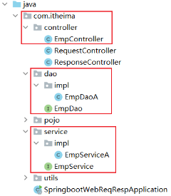
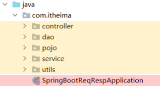

- [SpringBootWeb Controller](#springbootweb-controller)
  - [请求](#请求)
      - [简单参数](#简单参数)
      - [实体对象](#实体对象)
      - [数组集合参数](#数组集合参数)
      - [日期参数](#日期参数)
      - [JSON 参数](#json-参数)
      - [路径参数](#路径参数)
  - [响应](#响应)
      - [@ResponseBody](#responsebody)
      - [统一响应结果](#统一响应结果)
  - [分层解耦](#分层解耦)
      - [三层架构](#三层架构)
      - [IOC\&DI](#iocdi)
      - [IOC详解](#ioc详解)
      - [DI 详解](#di-详解)

---

# SpringBootWeb Controller

## 请求

如何接收客户端传递过来的数据

#### 简单参数

简单参数：向服务器传递的是一些普通的请求数据

==原始方式==

通过 Servlet 中提供的 API `HttpServletRequest` 获取请求的相关信息

```java
// 只做了解

@RestController
public class RequestController {
    @RequestMapping("/simpleParam")
    public String simpleParam(HttpServletRequest request){
        // http://localhost:8080/simpleParam?name=Tom&age=10
        // 请求参数： name=Tom&age=10
        // 第 1 个请求参数： name=Tom
        // 第 2 个请求参数： age=10
        String name_ = request.getParameter("name");
        String ageStr_ = request.getParameter("age");
        return "OK";
    }
}
```

==SpringBoot 方式==

GET 或 POST：“请求参数名” 与 “Controller 方法的形参变量名” 相同，可直接接收参数

~~~java
@RestController
public class RequestController {
    // http://localhost:8080/simpleParam?name=Tom&age=10
    // 第 1 个请求参数： name=Tom
    // 第 2 个请求参数： age=10
    @RequestMapping("/simpleParam")
    public String simpleParam(String name , Integer age ){
        System.out.println(name + age);
        return "OK";
    }
}
~~~

Spring 提供的 `@RequestParam` 注解完成映射

```java
@RestController
public class RequestController {
    // http://localhost:8080/simpleParam?name=Tom&age=20
    // 请求参数名 : age
    // Controller 方法的形参变量名 : age_
    @RequestMapping("/simpleParam")
    public String simpleParam(@RequestParam(name = "age")Integer age_ ){
        System.out.println(age);
        return "OK";
    }
}

// @RequestParam 中的 required 属性默认值为 true，代表该请求参数必须传递，如果不传递将报错
```

#### 实体对象

“请求参数名” 与 “Controller 方法的形参对象属性名” 相同

按照对象层次结构关系即可接收嵌套实体类属性参数

```java
// 请求路径
http://localhost:8080/simpleParam?name=Tom&age=20&address.province=x&address.city=y

// 请求参数
name : Tom
age : 10
address.province : ...
address.city : ...
```

```java
// Address

public class Address {
    private String province;
    private String city;
}
```

```java
// User

public class User {
    private String name;
    private Integer age;
    private Address address; //地址对象
}
```

```java
// Controller 方法

@RestController
public class RequestController {
    @RequestMapping("/complexPojo")
    public String complexPojo(User user){
        System.out.println(user);
        return "OK";
    }
}
```

#### 数组集合参数

==数组==

“请求参数名” 与 “形参数组名” 相同

```java
// 请求路径
http://localhost:8080/arrayParam?hobby=1&hobby=2&hobby=3
http://localhost:8080/arrayParam?hobby=1,2,3
```

```java
// Controller
@RestController
public class RequestController {
    @RequestMapping("/arrayParam")
    public String arrayParam(String[] hobby){
        return "OK";
    }
}
```

==集合==

“请求参数名” 与 “形参集合对象名相同”，`@RequestParam` 绑定参数关系

默认情况下，请求中参数名相同的多个值，是封装到数组，使用 `@RequestParam` 绑定参数关系封装到集合

```java
// 请求路径
http://localhost:8080/arrayParam?hobby=1&hobby=2&hobby=3
http://localhost:8080/arrayParam?hobby=1,2,3
```

```java
// Controller
@RestController
public class RequestController {
    @RequestMapping("/listParam")
    public String listParam(@RequestParam List<String> hobby){
        return "OK";
    }
}
```

#### 日期参数

通过 `@DateTimeFormat` 注解，用 `pattern` 属性来设置日期的格式

```java
// 请求路径
http://localhost:8080/dateParam?updateTime=2024-12-11 10:05:45
```

```java
// Controller
@RestController
public class RequestController {
   @RequestMapping("/dateParam")
    public String dateParam
    (@DateTimeFormat(pattern = "yyyy-MM-dd HH:mm:ss") LocalDateTime updateTime)
    {
        System.out.println(updateTime);
        return "OK";
    }
}
```
- `@DateTimeFormat` 注解的 `pattern` 属性中指定了哪种日期格式，请求路径的日期就必须按照指定的格式传递
- controller 方法中，需要使用 `Date` 类型或 `LocalDateTime` 类型，来封装传递的参数

#### JSON 参数

JSON 是开发中最常用的前后端数据交互方式

```
// 服务端 POST raw-JSON

{
    "name":...
    "age":...
    "addr":{
        ...
    }
}
```

```java
// 实体类
public class Address {
    private String province;
    private String city;
}
public class User {
    private String name;
    private Integer age;
    private Address address;
}    
```

```java
// Controller
@RestController
public class RequestController {
    @RequestMapping("/jsonParam")
    public String jsonParam(@RequestBody User user){
        return "OK";
    }
}
```

- `@RequestBody` 注解：将 JSON 数据映射到形参的实体类对象中
- JSON 中的 key 和类中的属性名保持一致

#### 路径参数

直接在请求的 URL 中传递参数

~~~
// 其中 1, 100 既是路径的一部分，也是参数

http://localhost:8080/user/1		
http://localhost:880/user/100
~~~

- 使用 `{...}` 来标识该路径参数
- 使用 `@PathVariable` 注解

```java
@RestController
public class RequestController {
    @RequestMapping("/path/{id}")
    public String pathParam(@PathVariable Integer id){
        System.out.println(id);
        return "OK";
    }
}
```

传递多个路径参数

~~~
// 1 和 xky 都是参数

http://localhost:8080/path/1/xky
~~~

~~~java
@RestController
public class RequestController {
    @RequestMapping("/path/{id}/{name}")
    public String pathParam2
    (@PathVariable Integer id, @PathVariable String name)
    {
        System.out.println(id + name);
        return "OK";
    }
}
~~~

## 响应

#### @ResponseBody

`@ResponseBody` 注解

- 类型：方法注解、类注解
- 位置：书写在 `Controller` 方法上或类上
- 作用：将方法返回值响应给浏览器
  - 如果返回值类型是实体对象/集合，将会转换为 JSON 格式再在响应给浏览器

在类上添加的 `@RestController` 注解，是一个组合注解

```java
@RestController = @Controller + @ResponseBody 
```

类上有 `@RestController` 注解或 `@ResponseBody` 注解时
- 表示当前类下所有的方法返回值做为响应数据
- 方法的返回值，是一个 POJO 对象或集合时，会先转换为 JSON 格式再响应给浏览器

#### 统一响应结果

==不好的测试==

~~~java
@RestController
public class ResponseController {
    // 响应字符串
    @RequestMapping("/hello")
    public String hello(){
        return "Hello World ~";
    }

    // 响应实体对象
    @RequestMapping("/getAddr")
    public Address getAddr(){
        Address addr = new Address();
        return addr;
    }

    // 响应集合数据
    @RequestMapping("/listAddr")
    public List<Address> listAddr(){
        List<Address> list = new ArrayList<>();//集合对象
        return list;
    }
}
~~~


```json
// 响应的测试效果
{
    {
        "x":...,
        "y":...
    },
    {
        "x":...,
        "y":...
    }
}
```

==更进后==

前面所编写的这些 Controller 方法中，返回值各种各样，没有任何的规范

在真实的项目开发中，无论是哪种方法，我们都会定义一个统一的返回结果

前端只需要按照统一格式的返回结果进行解析(仅一种解析方案)，就可以拿到数据

统一的返回结果使用类来描述，在这个结果中包含：

- 响应状态码：
- 状态码信息：给页面的提示信息
- 返回的数据：给前端响应的数据（字符串、对象、集合）

定义在一个实体类 `Result` 来包含以上信息

```java
public class Result {
    private Integer code;   // 响应码，1 代表成功; 0 代表失败
    private String msg;     // 响应码 描述字符串
    private Object data;    // 返回的数据

    public Result() { }
    public Result(Integer code, String msg, Object data) {
        this.code = code;
        this.msg = msg;
        this.data = data;
    }

    get, set ...

    // 增删改 成功响应，不需要给前端返回数据
    public static Result success(){
        return new Result(1,"success",null);
    }
    // 查询 成功响应，把查询结果做为返回数据响应给前端
    public static Result success(Object data){
        return new Result(1,"success",data);
    }
    // 失败响应
    public static Result error(String msg){
        return new Result(0,msg,null);
    }
}
```

~~~java
// 改造 Controller
@RestController
public class ResponseController { 
    @RequestMapping("/xxx")
    public Result xxx(){
        return Result.success(...);
    }
}
~~~

```json
// 响应的测试效果
{
    "code":     ,
    "msg":      ,
    "data":{}
}
```

## 分层解耦

#### 三层架构

尽可能让每一个接口、类、方法的职责更单一些，【单一职责原则】

组成上看可以分为三个部分：

- Controller 控制层 : 接收前端发送的请求，对请求进行处理，并响应数据
- Service 业务逻辑层 : 处理具体的业务逻辑
- Data Access Object 数据访问层 : 负责数据访问操作，包括数据的增、删、改、查

基于三层架构的程序执行流程：

- 前端发起的请求，由 Controller 层接收
- Controller 层调用 Service 层来进行逻辑处理
- Serivce 层调用 Dao 层
- Dao 层拿到的数据会返回给 Service 层
- Service 层处理完后，把处理结果返回给 Controller 层



#### IOC&DI

软件设计原则：高内聚低耦合

那应该怎么解耦呢

- 涉及到 Spring 的两个核心概念
  - 控制反转 Inversion Of Control, IOC
    - 对象的创建控制权由程序自身转移到外部容器
  - 依赖注入 Dependency Injection, DI
    - 容器为应用程序提供运行时所依赖的资源
  - IOC 容器中创建、管理的对象，称之为 【bean 对象】

步骤

1. 使用 Spring 提供的注解：`@Component` 就可以把类交给 IOC 容器管理

```java
// 类 XXX 交给 IOC 管理
@Component
public class XXX implements X{}
```

2. 使用 Spring 提供的注解：`@Autowired` 就可以实现 IOC 容器自动注入需要的依赖对象
```java
public class YYY{
    @Autowired
    private X x;
}
```

#### IOC详解

==bean 的声明==

`@Component` 的衍生注解：

- `@Controller` 标注在 Controller 层类上
- `@Service` 标注在 Serivce 层类上（ 由于与 mybatis 整合，用得少 ）
- `@Repository` 标注在 Dao 层类上

```java
// Dao 层的类 XXX 交给 IOC 管理
// value 可以用来指定 bean 的名字

@Repository(value="..")
public class XXX implements X{}
```

使用以上四个注解都可以声明 bean，但是在 springboot 集成 web 开发中，声明控制器 bean 只能用 `@Controller`

==组件扫描==

`@ComponentScan` 扫描到的 `@Component` 及其衍生注解才会生效

`@ComponentScan` 注解虽然没有显式配置，但是实际上已经包含在了引导类声明注解  `@SpringBootApplication` 中，默认扫描的范围是 SpringBoot 启动类所在包及其子包

因此我们的项目规范如下：

- 将定义的 `controller service dao` 这些包都放在引导类所在包下



#### DI 详解

`@Autowired` 注解，默认是按照 “类型” 进行自动装配的

如果在 IOC 容器中，存在多个相同类型的 bean 对象，需要如下方法解决问题

- `@Primary`
- `@Qualifier`
- `@Resource`


```java
// Primary 指定 bean 的优先级

@Primary
@Component
public class X implements XXX{}
```

```java
// Qualifier 指定注入 bean 的名称
// @Qualifier 注解不能单独使用，必须配合 @Autowired 使用

public class YYY{
    @Autowired
    @Qualifier("...")
    private X x;
}
```

```java
// Resource 指定注入 bean 的名称

public class YYY{
    @Resource(name="...")
    private X x;
}
```


面试题：`@Autowird` 与 `@Resource` 的区别
- `@Autowired` 是 spring 框架提供的注解，而 `@Resource` 是 JDK 提供的注解
- `@Autowired` 默认是按照类型注入，而 `@Resource` 是按照名称注入
