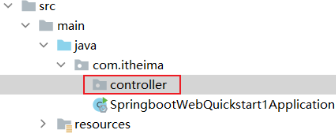

- [SpringBoot 基础](#springboot-基础)
  - [前言](#前言)
  - [SpringBootWeb Demo](#springbootweb-demo)
      - [起步依赖](#起步依赖)

---

# SpringBoot 基础

## 前言

Spring 的官网 https://spring.io

Spring 家族旗下这么多的技术，最基础、最核心的是 `SpringFramework`，其他的技术，都是基于 `SpringFramework`

通过 `springboot` 可以快速的构建应用程序，最大的特点有两个：

- 简化配置
- 快速开发

## SpringBootWeb Demo

需求：浏览器发起请求 `http://localhost:8080/hello` 后，给浏览器返回字符串 “Hello World”

1. 基于 Spring 官方骨架，创建 SpringBoot 工程，
   - 基本信息描述完毕之后，勾选 `web -> Spring Web` 依赖
   - 需要联网

2. 在包下创建一个子包 `controller`，再新建一个类 `HelloController`
   - 
   - 填入代码
      ```java
      @RestController
      public class HelloController {
          @RequestMapping("/hello")
          public String hello(){
              return "Hello World";
          }
      }    
      ```

3. 启动


输入网址：`http://192.168.100.11:8080/hello`

- 通过 IP 地址 `192.168.100.11` 定位到网络上的一台计算机
  - `localhost` 就是 `127.0.0.1`（本机）
- 通过端口号 `8080` 找到计算机上运行的程序
- `/hello` 请求资源位置
  - 资源：对计算机而言资源就是数据
  - web 资源：通过网络可以访问到的资源（通常是指存放在服务器上的数据）

服务器：可以理解为 ServerSocket

- 接收到浏览器发送的信息（如：/hello）
- 在服务器上找到 /hello 的资源
- 把资源发送给浏览器

#### 起步依赖

`spring-boot-starter-web` 和 `spring-boot-starter-test`

- `spring-boot-starter-test`：包含了单元测试所需要的常见依赖
- `spring-boot-starter-web`：包含了 web 应用开发所需要的常见依赖
  - 比如 tomcat 就被内置在这个依赖中

官方地址：https://docs.spring.io/spring-boot/docs/2.7.2/reference/htmlsingle/#using.build-systems.starters

每一个起步依赖，都用于开发一个特定的功能

- 当我们开发中需要使用 redis 数据库时，只需要在 SpringBoot 项目中
- 引入 `spring-boot-starter-redis`