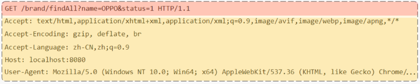
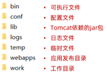

- [SpringBoot 基础](#springboot-基础)
  - [前言](#前言)
  - [SpringBootWeb Demo](#springbootweb-demo)
      - [起步依赖](#起步依赖)
  - [HTTP 协议](#http-协议)
      - [请求](#请求)
      - [响应](#响应)
      - [协议解析](#协议解析)
  - [Tomcat](#tomcat)
      - [Web 服务器](#web-服务器)
      - [基本使用](#基本使用)

---

# SpringBoot 基础

## 前言

Spring 的官网 https://spring.io

Spring 家族旗下这么多的技术，最基础、最核心的是 `SpringFramework`，其他的技术，都是基于 `SpringFramework`

通过 `springboot` 可以快速的构建应用程序，最大的特点有两个：

- 简化配置
- 快速开发

## SpringBootWeb Demo

需求：浏览器发起请求 `http://localhost:8080/hello` 后，给浏览器返回字符串 “Hello World”

1. 基于 Spring 官方骨架，创建 SpringBoot 工程，
   - 基本信息描述完毕之后，勾选 `web -> Spring Web` 依赖
   - 需要联网

2. 在包下创建一个子包 `controller`，再新建一个类 `HelloController`
   - 
   - 填入代码
      ```java
      @RestController
      public class HelloController {
          @RequestMapping("/hello")
          public String hello(){
              return "Hello World";
          }
      }    
      ```

3. 启动


输入网址：`http://192.168.100.11:8080/hello`

- 通过 IP 地址 `192.168.100.11` 定位到网络上的一台计算机
  - `localhost` 就是 `127.0.0.1`（本机）
- 通过端口号 `8080` 找到计算机上运行的程序
- `/hello` 请求资源位置
  - 资源：对计算机而言资源就是数据
  - web 资源：通过网络可以访问到的资源（通常是指存放在服务器上的数据）

服务器：可以理解为 ServerSocket

- 接收到浏览器发送的信息（如：/hello）
- 在服务器上找到 /hello 的资源
- 把资源发送给浏览器

#### 起步依赖

`spring-boot-starter-web` 和 `spring-boot-starter-test`

- `spring-boot-starter-test`：包含了单元测试所需要的常见依赖
- `spring-boot-starter-web`：包含了 web 应用开发所需要的常见依赖
  - 比如 tomcat 就被内置在这个依赖中

官方地址：https://docs.spring.io/spring-boot/docs/2.7.2/reference/htmlsingle/#using.build-systems.starters

每一个起步依赖，都用于开发一个特定的功能

- 当我们开发中需要使用 redis 数据库时，只需要在 SpringBoot 项目中
- 引入 `spring-boot-starter-redis`

## HTTP 协议

- 基于 TCP 协议
- 基于请求-响应模型：一次请求对应一次响应
- HTTP 协议是无状态协议：对于数据没有记忆能力，每次请求-响应都是独立的

#### 请求

==请求格式==



* 请求行 ：HTTP 请求中的第一行数据
  * 由：`请求方式 资源路径 协议/版本` 组成
* 请求头 ：第二行开始，格式为 `key: value` 形式 
  ~~~
  Host: 表示请求的主机名
  User-Agent: 浏览器版本
  Accept：表示浏览器能接收的资源类型
  Accept-Language：表示浏览器偏好的语言
  Accept-Encoding：表示浏览器可以支持的压缩类型，例如 `gzip`
  Content-Type：请求主体的数据类型
  Content-Length：数据主体的大小（单位：字节）
  ~~~
* Post 请求在最后额外有一行存储请求参数，叫请求体

#### 响应

==响应格式==

* 响应行：由`协议及版本 响应状态码 状态码描述` 组成
* 响应头：响应数据的第二行开始，格式为 `key：value` 形式
  ~~~
  Content-Type：表示该响应内容的类型，例如 text/html，image/jpeg
  Content-Length：表示该响应内容的长度
  Content-Encoding：表示该响应压缩算法，例如 gzip 
  Cache-Control：指示客户端应如何缓存，例如 max-age=300 表示可以最多缓存 300 秒
  Set-Cookie: 告诉浏览器为当前页面所在的域设置 cookie
  ~~~
- 响应体：存储响应的数据

==响应状态码==

- 1xx: 响应中
- 2xx: 成功
- 3xx: 重定向
- 4xx: 客户端错误
- 5xx: 服务器端错误
- 常见
  * 200    ok   客户端请求成功
  * 404  Not Found  请求资源不存在
  * 500  Internal Server Error  服务端发生不可预期的错误

#### 协议解析

- 后端需要程序来识别和处理浏览器通过 http 发过来的格式
- 后端需要程序来把响应数据封装成 http 格式发给浏览器
- 但这些程序不再需要自己写

使用目前比较流行的 web 服务器，如：`Tomcat`

## Tomcat

是 Apache 软件基金会的一个核心项目，是一个开源免费的轻量级 Web 服务器

官网: https://tomcat.apache.org

#### Web 服务器

Web 服务器是一个应用程序，对 HTTP 协议的操作进行封装，使得程序员不用自己写代码去解析 http 协议规则

Web 服务器是安装在服务器端的一款软件，将来我们把自己写的 Web 项目部署到 Tomcat 服务器软件中，当 Web 服务器软件启动后，部署在 Web 服务器软件中的页面就可以直接通过浏览器来访问了

Web 服务器软件使用步骤

* 准备静态资源
* 下载安装 Web 服务器软件
* 将静态资源部署到 Web 服务器上
* 启动 Web 服务器
* 自此使用浏览器就可以访问对应的资源

Tomcat, jetty, WbLogic, WebSphere 都是比较好的 Web 服务器

#### 基本使用

==安装启动==

下载：https://tomcat.apache.org/download-90.cgi
- `64-bit-Windows-zip`
- `tar gz` 是 linux 和 mac 的压缩

目录结构
- 
- `bin` 目录下有两类文件
  - `.bat`，是 Windows 系统的可执行文件
  - `.sh`，是 Linux 系统的可执行文件

启动 Tomcat

- `bin/startup.bat`
- 只要黑窗口不关闭，就证明 tomcat 服务器正在运行
- Tomcat 的默认端口为 8080，输入：`http://127.0.0.1:8080` 访问 tomcat 服务器

关闭 Tomcat

1. 强制关闭：直接 `x` 掉 Tomcat 窗口
2. 正常关闭：`bin\shutdown.bat`
3. 正常关闭：在 Tomcat 启动窗口中按下 `Ctrl+C`

部署
- 项目放在 `webapps` 下进行部署

==常见问题==

1. Tomcat 启动时，窗口一闪而过
   - 检查 `JAVA_HOME` 环境变量是否正确配置

2. 端口号冲突
   - Address already in use: bind
   - 解决方案：换 Tomcat 端口号，修改 `conf/server.xml` 文件
     - `<Connector port="" />`
   - HTTP 协议默认端口号为 80，如果将 Tomcat 端口号改为 80，则访问 Tomcat 时，不用输入端口号

3. 遇到控制台有中文乱码时，修改 `conf/logging.prooperties` 文件解决
   - `java.util.logging.ConsoleHandler.encoding = GBK`
