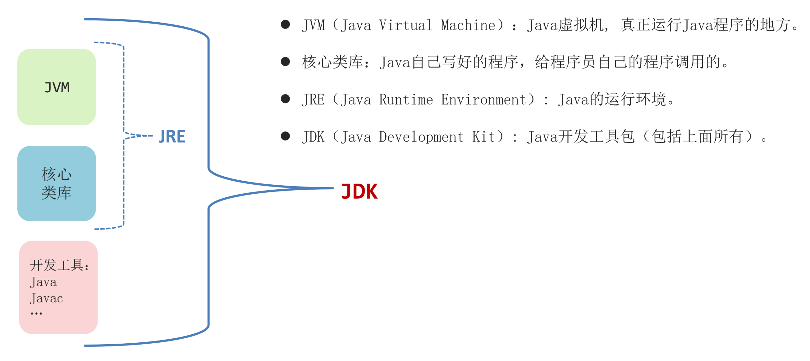
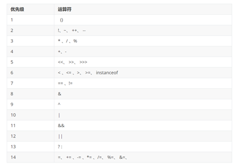

- [环境搭配](#环境搭配)
  - [Java 的技术体系](#java-的技术体系)
  - [JDK 快速入门](#jdk-快速入门)
      - [JDK 的组成](#jdk-的组成)
      - [JDK 环境变量配置](#jdk-环境变量配置)
  - [Java 开发工具](#java-开发工具)
      - [IDEA 下载和安装](#idea-下载和安装)
      - [IDEA 编写 Java 程序](#idea-编写-java-程序)
      - [IDEA 各种配置](#idea-各种配置)
      - [常用快捷键](#常用快捷键)
- [Java 基础语法](#java-基础语法)
  - [注释](#注释)
  - [字面量](#字面量)
  - [变量](#变量)
  - [关键字](#关键字)
  - [标志符](#标志符)
  - [不同进制在 Java 程序中的书写格式](#不同进制在-java-程序中的书写格式)
  - [数据类型详解](#数据类型详解)
  - [数据类型转换](#数据类型转换)
      - [自动类型转换](#自动类型转换)
      - [强制类型转换](#强制类型转换)
  - [运算符](#运算符)
      - [算术运算符](#算术运算符)
      - [自增自减运算符](#自增自减运算符)
      - [赋值运算符](#赋值运算符)
      - [关系运算符](#关系运算符)
      - [逻辑运算符](#逻辑运算符)
      - [三元运算符](#三元运算符)
      - [运算优先级](#运算优先级)
- [程序流程控制](#程序流程控制)
  - [分支结构](#分支结构)
      - [`if`](#if)
      - [`switch`](#switch)
  - [循环结构](#循环结构)
      - [`for`](#for)
      - [`while`](#while)
      - [`do-while`](#do-while)
      - [`break continue`](#break-continue)
- [数组](#数组)
  - [静态初始化](#静态初始化)
  - [动态初始化](#动态初始化)
  - [访问](#访问)
  - [二维数组](#二维数组)
- [方法](#方法)
  - [方法概述](#方法概述)
  - [方法重载](#方法重载)

---

# 环境搭配

## Java 的技术体系

Java 为了满足不同的应用场景提供了不同的技术版本，主要有三个版本

- Java SE（Java Standard Edition）：标准版，它是后面两个版本的基础，也就是学习后面两个版本必须先学习 JavaSE
  - 基础班现阶段学习的就是这个版本中的技术

- Java EE（Java Enterprise Edition）: 企业版，它是为企业级应用开发提供的一套解决方案
  - 就业班课程中主要学习这个版本中的技术
- Java ME（Java Micro Edition）：小型版，它为开发移动设备的应用提供了一套解决方案
  - 目前已经不被市场认可（淘汰），取而代之的是基于 Android 系统的应用开发


## JDK 快速入门

#### JDK 的组成

用 `javac` 命令编译，用 `Java` 命令运行

JDK 由 `JVM、核心类库、开发工具` 组成，如下图所示



#### JDK 环境变量配置

`JAVA_HOME = C:\e\java`

`%JAVA_HOME%\bin`


## Java 开发工具

#### IDEA 下载和安装

[IDEA 入门手册](./assets/IDEA入门手册.pdf)

#### IDEA 编写 Java 程序

Java 程序的工程结构

- 一个 Project，统称为工程
- Project 中创建 Module（模块），一个工程中可以包含多个模块
- Module 中新建 Package（包），一个模块中可以有多个包
- Package 中新建 Class（类），一个包中可以包含多个类

#### IDEA 各种配置

参考 [IDEA 入门手册](IDEA入门手册.pdf)


#### 常用快捷键

下面是几种常见的快捷键

| **快捷键**                        | **功能效果**                     |
| --------------------------------- | -------------------------------- |
| main/psvm、sout、…                | 快速键入相关代码                 |
| Ctrl + D                          | 复制当前行数据到下一行           |
| Ctrl + Y                          | 删除所在行，建议用Ctrl + X       |
| Ctrl + ALT + L                    | 格式化代码                       |
| ALT + SHIFT + ↑ , ALT + SHIFT + ↓ | 上下移动当前代码                 |
| Ctrl + / , Ctrl + Shift + /       | 对代码进行注释(讲注释的时候再说) |


# Java 基础语法

## 注释

```java
1. 单行注释：
    //后面根解释文字

2. 多行注释
    /*
    这里写注释文字
    可以写多行
    */

3. 文档注释
    /**
    这里写文档注释
    也可以写多行，文档注释可以利用JDK的工具生成帮助文档
    */
```

使用快捷键加注释

```java
Ctrl + / 	单行注释（对当前行进行注释）
Ctrl + Shift + / 	对选中的代码进行多行注释
```

## 字面量

数据在程序中的书写格式

- 字符：`'`
- 字符串：`"`
- bool 值：`true false`
- 空值：`null`

## 变量

```java
// 类似于 C

int age = 18, gender = 1;

System.out.println(a);
```

## 关键字

| abstract   | assert       | boolean   | break      | byte   |
| ---------- | ------------ | --------- | ---------- | ------ |
| case       | catch        | char      | class      | const  |
| continue   | default      | do        | double     | else   |
| enum       | extends      | final     | finally    | float  |
| for        | goto         | if        | implements | import |
| instanceof | int          | interface | long       | native |
| new        | package      | private   | protected  | public |
| return     | strictfp     | short     | static     | super  |
| switch     | synchronized | this      | throw      | throws |
| transient  | try          | void      | volatile   | while  |

## 标志符

强制要求：必须遵守，不遵守就会报错

1. 最好是 `字母、数字、下划线、$` 组成
2. 不能以数字开头
3. 不能是Java的关键字

## 不同进制在 Java 程序中的书写格式

```java
System.out.pirntln(0b01100001);  // 二进制 97
System.out.pirntln(0141);       // 八进制 97
System.out.pirntln(0x61);      // 十六进制 97
```

## 数据类型详解

Java 的数据类型整体上来说分为两大类

- 基本数据类型
- 引用数据类型 

基本数据类型如下图


需要我们注意的是，随便写一个整数或者小数的字面量，它也是有默认数据类型的

- 比如 23，它默认就为 int 类型；如果加上后缀 L，则为 long 类型
- 比如 23.8，它默认为 double 类型；如果加上后缀 F，则为 float 类型


## 数据类型转换

#### 自动类型转换

代码演示

```java
int c = 100;
double d = c;   // 发生了自动类型转换了

// 发生了自动类型转换了
// 0000000 01100001 => 00000000 00000000  00000000 01100001
char ch = 'a'; 
int i = ch; 
```

如果同一个表达式中，出现不同类型的数据一起运算，这种情况下运算结果遵守下面的两条运算规则：

1. 多种数据类型参与运算，其结果以大的数据类型为准
2. `byte,short,char` 在和其他类型数据运算前，都会先转换为 `int` 类型再运算

接下来我们来看代码演示，自己试一试

```java
byte a = 10;
int b = 20;
long c = 30;

long rs = a + b + c;
double rs2 = a + b + 1.0;

byte i = 10;
short j = 30;
int rs3 = i + j;

// 面试笔试题： 即使两个 byte 运算，结果也会提升为 int
byte b1 = 110;
byte b2 = 80;
int b3 = b1 + b2;
```

#### 强制类型转换

强制类型转换的代码演示

```java
int a = 20;
byte b = (byte) a;  // ALT + ENTER 强制类型转换

int i = 1500;
byte j = (byte) i;

double d = 99.5;
int m = (int) d; // 丢掉小数部分，保留整数部分
```

## 运算符

#### 算术运算符

算术运算符有 `+ - * / % ` ，其中 `/` 表示除法，`%` 表示取余数

需要我们注意的是：

- `+` 符号与字符串运算的时候是用作连接符的，其结果依然是一个字符串

```java
int a = 5;
System.out.println("abc" + a); // "abc5"
System.out.println(a + 5); //  10
System.out.println("itheima" + a + 'a'); // "itheima5a"
System.out.println(a + 'a' + "itheima"); // 102itheima
```

#### 自增自减运算符

`++` 和 `--` 

`++`读作自增，`--`读作自减； 运算规则如下


#### 赋值运算符

除了基本的赋值运算符，我们这里主要学习一下扩展的赋值运算符

`+= -= *= /= %=`

```java
byte x = 10;
byte y = 30;
x = x + y;  
// 代码有问题，因为两个 byte 类型数据相加，会提升为 int 类型;


byte x = 10;
byte y = 30;
x+=3; 
// 代码没有问题，因为这里有隐含的强制类型转换
// x+=3; 等价于 byte x = (byte)(x+y);
```

#### 关系运算符

每一个关系运算符的结果都是 bool

与 C 一样

#### 逻辑运算符

用来将多个条件放在一起运算，最终结果是 bool


```java
// 需求：要求手机必须满足尺寸大于等于 6.95，且内存必须大于等于 8
size >= 6.95 & storage >= 8;

// 需求：要求手机要么满足尺寸大于等于 6.95，要么内存大于等于 8
size >= 6.95 | storage >= 8;

// ! 
System.out.println(!true);     // false
System.out.println(!(2 > 1)); // false

// ^ 
System.out.println(true ^ true);   // false
System.out.println(true ^ false); // true
```

#### 三元运算符

```java
exp ? val1 : val2;
```

exp 的值为 true，则返回值 val1；反之返回 val2

#### 运算优先级



在实际开发中，其实我们很少考虑运算优先级，如果你想让某些数据先运算，其实加 `()` 就可以了，这样阅读性更高


# 程序流程控制

## 分支结构

#### `if`

```java
if (exp) {

}
```


```java
if (exp) {

} else {

}
```

```java
if (exp) {

} else if(exp){

} else if(exp){

} else {

}
```


#### `switch`

```java
String week = "周三";
switch (week){
    case "周一":
        break;

    case "周二":
        break;

    case "周三":
        break;

    default:
        System.out.println("default");
}
```

switch 注意事项

- 表达式类型不支持 double、float
    
- case 给出的值不允许重复，且只能是字面量，不能是变量	
- 正常使用 switch 的时候，不要忘记写 break，否则会出现穿透现象

## 循环结构

#### `for`

```java
for(int i = 0; i < 3; i++) {
    System.out.println("Hello World");
}
```

#### `while`

```java
while (exp) {
    System.out.println("Hello World");
}
```

#### `do-while`

```java
do {
    System.out.println("Hello World");
} while (exp);
```

#### `break continue`

- break：跳出并结束当前所在循环的执行
- continue：结束本次循环，进入下一次循环


# 数组

## 静态初始化

```java
int[] ages = new int[]{12, 24, 36};

int[] ages = {12, 24, 36};
int ages[] = {12, 24, 36};
```

## 动态初始化

动态初始化不需要我们写出具体的元素，而是指定元素类型和长度就行

```java
//数据类型[]  数组名 = new 数据类型[长度];

int[] arr = new int[3];
```

使用动态初始化定义数组时，根据数据类型不同，默认值也有所不同

- int : 0
- double : 0.0
- boolean : false
- 类 接口 数组 String : null

## 访问

```java
System.out.println(arr[0]);

arr[1] = 66;

System.out.println(arr.length);
```

## 二维数组

```java
// 静态
int[][] arr = new int[][] {{}, {}};
int[][] arr = {{}, {}};

// 动态
int[][] arr = new int[2][3];
```


# 方法

## 方法概述

```java
// 格式

modifier return funcName (args) { }
```

```java
public static int sum(int a,int b) {
    int c = a + b;
    return c;
}
```

1. modifier : 暂时都使用 `public static` 修饰
2. 形参不能给初始化值
3. 方法在类中没有先后顺序，但是不能把一个方法定义在另一个方法中
4. 方法是在栈内存中执行
5. 参数传递机制都是：值传递
6. `return;` 直接结束当前方法


## 方法重载

- 一个类中，方法名相同，==形参列表==不同
  - 形参列表不同：形参的个数、类型、顺序不同，不关心形参的名称
- 其它的都不管（如：修饰符，返回值类型是否一样都无所谓）

下面案例中有多个 `test()` 方法，但是参数列表都不一样，它们都是重载，调用时通过参数来区分

```java
public class MethodOverLoadDemo1 {
    public static void main(String[] args) {
        // 目标：认识方法重载，并掌握其应用场景。
        test();
        test(100);
    }

    public static void test(){
        System.out.println("===test1===");
    }

    public static void test(int a){
        System.out.println("===test2===" + a);
    }
}
```

```java
public class MethodTest2 {
    public static void main(String[] args) {
        // 目标：掌握方法重载的应用场景。
        fire();
        fire("岛国2");
        fire("米国", 999);
    }

    public static void fire(){
        fire("岛国");
    }

    public static void fire(String country){
        fire(country, 1);
    }

    public static void fire(String country, int number){
        System.out.println("发射了" + number + "枚武器给" + country);
    }
}
```
