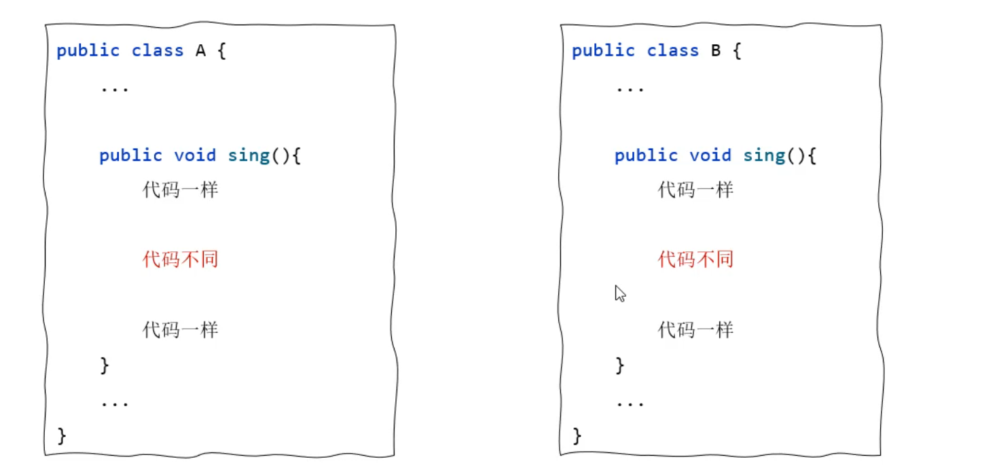

- [面向对象基础](#面向对象基础)
  - [构造](#构造)
  - [封装性](#封装性)
  - [JavaBean 实体类](#javabean-实体类)
  - [static](#static)
      - [工具类](#工具类)
      - [代码块](#代码块)
      - [单例设计模式](#单例设计模式)
  - [final](#final)
      - [补充知识：常量](#补充知识常量)
- [继承](#继承)
  - [继承快速入门](#继承快速入门)
  - [方法重写](#方法重写)
  - [权限修饰符](#权限修饰符)
  - [子类构造](#子类构造)
- [多态](#多态)
  - [多态概述](#多态概述)
  - [类型转换](#类型转换)
  - [抽象](#抽象)
      - [认识抽象类](#认识抽象类)
      - [模板方法模式](#模板方法模式)
  - [接口](#接口)
      - [认识接口](#认识接口)
      - [JDK8/9 的新特性](#jdk89-的新特性)
- [内部类](#内部类)
  - [种类](#种类)
      - [成员内部类](#成员内部类)
      - [静态内部类](#静态内部类)
      - [局部内部类](#局部内部类)
      - [匿名内部类](#匿名内部类)
  - [Lambda表达式](#lambda表达式)
      - [Lambda 表达式基本使用](#lambda-表达式基本使用)
      - [省略规则](#省略规则)

---

# 面向对象基础

类的五大成分：成员变量、成员方法、构造、内部类、代码块

在 java 中用 `class` 来设计对象

- 一个代码文件中，可以写多个 `class` 类，但是只能有一个是 `public` 修饰，且 `public` 修饰的类必须和文件名相同

## 构造

在创建对象时，会调用构造器

也就是说 `new Student()` 就是在执行构造器，当构造器执行完了，也就意味着对象创建成功

用来在创建对象时给对象的属性做一些初始化操作

[格式]()

- 方法名与类名相同
- 没有返回值类型，`void` 都没有
- 没 `return`
- 可以有参数

[注意事项]()

- 如果不写构造器，Java 会自动生成一个无参数构造器
- 定义了有参数构造器，Java 就不再提供空参数构造器，此时建议自己加一个无参数构造器

## 封装性

面向对象很重要的特征[封装性]()

| 可以访问的类     | private | (default) | protected | public |
| ---------------- | :-----: | :-------: | :-------: | :----: |
| 同一类           |    √    |     √     |     √     |   √    |
| 同一包中的类     |         |     √     |     √     |   √    |
| 不同包下的父子类 |         |           |     √     |   √    |
| 不同包下的类     |         |           |           |   √    |

## JavaBean 实体类

如下的标准：

- 类中成员变量都 `private`，且对外提供 `getXxx()` `setXxx()`
- 提供无参，带参的构造方法
  - 快捷键：`右键 -> Generate -> Constructor/Getter/Setter`
  - `Ptg To JavaBean`

在实际开发中，实体类仅仅只用来封装数据，而对数据的处理交给其他类来完成，以实现数据和数据业务处理相分离，如下

```java
public class Student {
    private String name;
    prevate double score;
}

public class StudentOpt {
    private Student s;
    public StudentOpt(Student ss){
        this.s = ss;
    }
    // 打印成绩等级
    // 等等其他对 Student 数据操作的函数
}
```

## static

`static` 修饰成员变量：类变量，只有一份，被所有对象共享

- 通过类名可以调用：`className.staticVal`

`static` 修饰成员方法

- 通过类名可以调用：`className.staticFunc()`


被 `static` 修饰的成员是是随着类的加载而加载的，所以不用 `new className()` 就能直接使用

#### 工具类

一个类中的方法全都是静态的，把这样的类就叫做[工具类]()

这种情况下我们会把构造函数改造成 `private`


#### 代码块

- 静态代码块，随着类的加载而执行，而且只执行一次

    ```java
    public class Student {
        static int number = 80;
        static String schoolName = "黑马";

        // 静态代码块
        static {
            System.out.println("静态代码块执行了~~");
        }
    }
    ```


- 实例代码块每次创建对象之前都会执行一次，执行在构造函数之前

    ```java
    public class Student{
        //实例变量
        int age;

        //实例代码块：实例代码块会执行在每一个构造方法之前
        {
            System.out.println("实例代码块执行了~~");
            age = 18;
            System.out.println("有人创建了对象：" + this);
        }

        public Student(){
            System.out.println("无参数构造器执行了~~");
        }
    }
    ```

#### 单例设计模式

//

## final

为后面学习抽象类和接口做准备

[特点]()

- final 修饰类：该类不能被继承
- final 修饰方法：该方法不能被重写
- final 修饰变量：该变量只能被赋值一次

#### 补充知识：常量

- 被 `static final` 修饰的成员变量，称之为常量
- 通常用于记录系统的配置信息

接下来我们用代码来演示一下

```java
public class Constant {
    // 常量: 定义一个常量表示学校名称
    // 常量命名规范：建议都采用大写字母命名，多个单词之前用 _ 隔开
    // 为了方便在其他类中被访问所以一般还会加上 public 修饰符

    public static final String SCHOOL_NAME = "fuck";
}
```


# 继承

## 继承快速入门

`extends` 让一个类和另一个类建立起父子关系，提高代码的复用性

特点

- 子类继承父类的非私有成员
- 子类的对象是由子类、父类共同构成的
- java 只支持单继承，但支持多层继承
- java 中所有类，都直接或间接继承到了 Object 类
- `super` 指向父类的区域

案例

```java
public class A{
    //公开的成员
    public int i;
    public void print1(){
        System.out.println("===print1===");
    }
    
    //私有的成员
    private int j;
    private void print2(){
        System.out.println("===print2===");
    }
}
```

让 B 类继承 A 类

在继承 A 类的同时，B 类中新增一个方法 `print3()`

```java
public class B extends A{
    public void print3(){
        // 由于 i 和 print1 是属于父类 A 的公有成员，在子类中可以直接被使用
        System.out.println(i); // 正确
        print1(); // 正确
        
        // 由于 j 和 print2 是属于父类 A 的私有成员，在子类中不可以被使用
        System.out.println(j); // 错误
        print2(); // 错误
    }
}
```

子类对象实际上是由子、父类两张设计图共同创建出来的

所以，在子类对象的空间中，既有本类的成员，也有父类的成员

## 方法重写

子类与父类中，出现了一个[方法声明]()一摸一样的方法 ( 包括 `return funcName arg[]` )

- 注解：`@Override`
- 重写时子类方法的权限大于等于父类的

## 权限修饰符

权限修饰符是用来限制类的成员能够被访问的范围

| 可以访问的类     | private | (default) | protected | public |
| ---------------- | :-----: | :-------: | :-------: | :----: |
| 同一类           |    √    |     √     |     √     |   √    |
| 同一包中的类     |         |     √     |     √     |   √    |
| 不同包下的父子类 |         |           |     √     |   √    |
| 不同包下的类     |         |           |           |   √    |

## 子类构造


子类的构造函数会先调用父类构造函数

```java
class Teacher exends People{
    private String skill;

    public Teacher(String name, int age, String skill){
        super(name, age);
        this.skill = skill;
    }
}
```

[总结]()

访问本类成员：
- `this.成员变量`	  //访问本类成员变量
- `this.成员方法`	 //调用本类成员方法
- `this()`		   //调用本类空参数构造器
- `this(参数)`	  //调用本类有参数构造器
	
访问父类成员：
- `super.成员变量`	  //访问父类成员变量
- `super.成员方法`	 //调用父类成员方法
- `super()`		   //调用父类空参数构造器
- `super(参数)`	  //调用父类有参数构造器
    
注意：`this` 和 `super` 调用构造方法的语句必须放在构造方法的第一条语句的位置


# 多态

## 多态概述

前提

- 有 `extends/implements` 关系
- 有 `Override`
- `Father a = new Son()`

好处

- 定义方法时，使用父类类型作为形参，可以接收一切子类对象


## 类型转换

`Father a = new Son()`

`Son b = (Son) a`

`val instance className` 判断 val 是否属于 className 

原本是什么类型，才能还原成什么类型

## 抽象

#### 认识抽象类

关键字 `abstract`，它可以修饰类也可以修饰方法

- 被 `abstract` 修饰的类，就是抽象类
- 被 `abstract` 修饰的方法，就是抽象方法（不允许有方法体）


接下来用代码来演示一下抽象类和抽象方法

```java
// 抽象类
public abstract class A {
    //成员变量
    private String name;
    static String schoolName;

    //构造方法
    public A(){

    }

    //抽象方法
    public abstract void test();

    //实例方法
    public String getName() {
        return name;
    }
}
```

- 抽象类是不能创建对象的，如果抽象类的对象就会报错

    ```java
    A a = new A()
    ```

- 子类继承抽象类必须重写它的所有抽象方法

    ```java
    // B类继承 A 类，必须复写 test 方法
    public class B extends A {
        @Override
        public void test() {

        }
    }
    ```

- 子类继承父类如果不复写父类的抽象方法，要想不出错，这个子类也必须是抽象类

#### 模板方法模式

利用抽象类实现的==模板方法设计模式==

- 什么是设计模式？
  - 解决某一类问题的最优方案

- 模板方法设计模式解决什么问题呢？
  - 模板方法模式主要解决方法中存在重复代码的问题

比如A类和B类都有sing()方法，sing()方法的开头和结尾都是一样的，只是中间一段内容不一样。此时A类和B类的sing()方法中就存在一些相同的代码



我们可以写一个抽象类 C 类

在 C 类中写一个 `doSing()` 的抽象方法

再写一个 `sing()` 方法包含 `doSing()`，代码如下：

```java
// 模板方法设计模式
public abstract class C {
    // 模板方法
    public final void sing(){
        same pattern;

        doSing();

        same pattern;
    }

    public abstract void doSing();
}
```

然后，写一个A类继承C类，复写doSing()方法，代码如下

```java
public class A extends C{
    @Override
    public void doSing() {
        System.out.println("A");
    }
}
```

接着，再写一个B类继承C类，也复写doSing()方法，代码如下

```java
public class B extends C{
    @Override
    public void doSing() {
        System.out.println("B");
    }
}
```

## 接口

#### 认识接口

关键字 `interface`

```java
interface name{
    //成员变量（常量）
    //成员方法（抽象方法）
}
```

```java
// 定义一个 interA
public interface A{
    // public static final 默认存在
    public static final String SCHOOL_NAME = "黑马程序员";
    
    // public abstract 默认存在
    public abstract void test();
}
```

```java
// 访问变量

public class Test{
    public static void main(String[] args){
        //打印A接口中的常量
        System.out.println(A.SCHOOL_NAME);
    }
}
```

1. 接口是用来被类实现的（implements），一个类是可实现多个接口，弥补了单继承的不足

    ```java
    // classC 同时实现 interA 和 interB

    // 实现类
    public class C implements A, B{
        @Override
        func();
    }
    ```

2. 接口可以多继承

    ```java
    // interC 继承 interA，interB

    public interface C extends A, B{

    }
    ```

3. 没有构造函数

4. 不能实例化

#### JDK8/9 的新特性

`interface` 成员函数可以有逻辑了

1. 使用 `default` 修饰，默认 public 权限
   - 使用实现类的对象来调用
2. 使用 `static` 修饰，默认 public 权限
   - 使用接口名来调用
3. 使用 `private` 修饰

```java
public interface A {

    default void test1(){
    }

    static void test2(){
    }

    private void test3(){
    }
}
```

# 内部类

如果一个类定义在另一个类的内部，这个类就是内部类

```java
public class A{
    //内部类
    public class B{
    }
}
```

内部类有四种形式，分别是成员内部类、静态内部类、局部内部类、匿名内部类

## 种类

#### 成员内部类

成员内部类就是类中的一个普通成员

```java
public class Outer {
    private int age = 99;

    // 成员内部类
    public class Inner{
        private  int age = 88;

        //在内部类中既可以访问自己类的成员，也可以访问外部类的成员
        public void test(){
            int age = 77;
            System.out.println(age); //77
            System.out.println(this.age); //88
            System.out.println(Outer.this.age); //99
        }
    }
}
```

```java
// 外部类.内部类 变量名 = new 外部类().new 内部类();

Outer.Inner in = new Outer().new Inner();

in.test();
```

#### 静态内部类

静态内部类属于外部类自己持有

```java
public class Outer {
    int age = 99;
    static String schoolName = "黑马";

    // 静态内部类
    public static class Inner{
        public void test(){
            System.out.println(schoolName);
            // System.out.println(age);   //报错
            // 原因在于 class Inner 是静态，它非常早就被创建了，那个时候还没有 age
        }
    }
}
```

```java
//格式：外部类.内部类 变量名 = new 外部类.内部类();

Outer.Inner in = new Outer.Inner();
```

#### 局部内部类

```java
public class Outer{
    public void test(){
        // 局部内部类，定义在 test 方法中
        class Inner{
        }
        
        // 局部内部类只能在方法中创建对象，并使用
        Inner in = new Inner();
    }
}
```

#### 匿名内部类

下面就是匿名内部类的格式：

```java
new 父类/接口名(){
    @Override
    重写父类/接口的方法;
}
```

匿名内部类本质上是一个没有名字的子类对象、或者接口的实现类对象

匿名内部类在编写代码时没有名字，编译后系统会为自动为匿名内部类生产字节码，字节码的名称会以 `外部类$1.class` 的方法命名


```java
public interface Swimming{
    public void swim();
}
```

```java
public class Test{
    public static void main(String[] args){
        Swimming s1 = new Swimming(){
            public void swim(){System.out.println("x");}
        };
        
        Swimming s2 = new Swimming(){
            public void swim(){
                System.out.println("xx");
            }
        };

    }
}
```

## Lambda表达式

JDK8 新增的一种语法形式，叫做 Lambda 表达式

作用：用于简化匿名内部类代码的书写

IDEA 中 `alt + enter` 实现内部类到 Lambda 的转换

#### Lambda 表达式基本使用

```java
() -> {}

(形参列表) -> {
    Override
}
```

需要给说明一下的是，在使用 Lambda 表达式之前，必须先有一个接口，而且接口中只能有一个抽象方法 **（注意：不能是抽象类，只能是接口）**

我们称之为函数式接口 FunctionalInterface，只有基于它的匿名内部类才能被 Lambda 表达式简化

#### 省略规则

```java
1. Lambda 的标准格式

	(参数类型 1 参数名 1, 参数类型 2 参数名 2) -> {
		...方法体的代码...
		return 返回值;
	}


2. ()中的参数类型可以直接省略

	(参数名 1, 参数名 2)->{
		...方法体的代码...
		return 返回值;
	}
	

3. 如果 {} 总的语句只有一条语句，则{}可以省略、return 关键字、以及最后的 “;” 都可以省略

	(参数名 1, 参数名 2)-> 返回值


4. 如果 () 里面只有一个参数，则 () 可以省略

	参数名-> {}
```