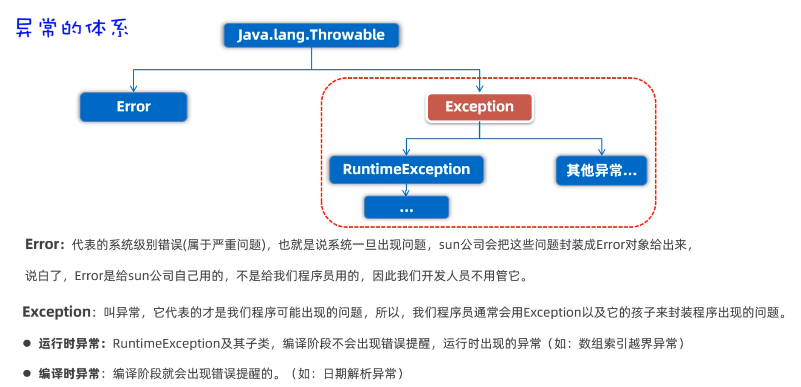
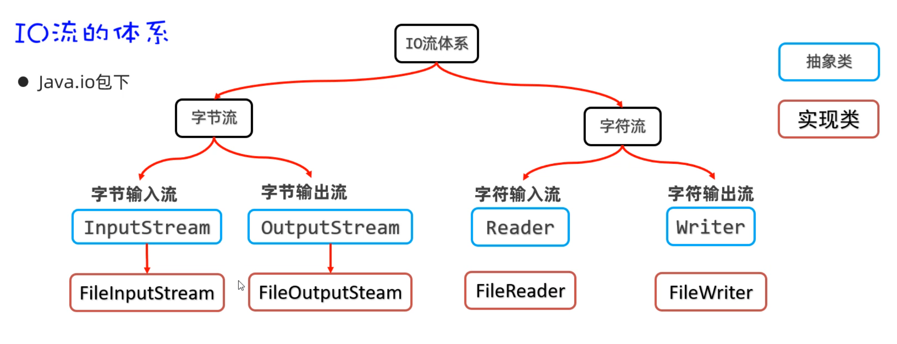

- [异常](#异常)
  - [异常处理](#异常处理)
  - [自定义异常](#自定义异常)
- [泛型](#泛型)
  - [自定义泛型类](#自定义泛型类)
  - [自定义泛型接口](#自定义泛型接口)
  - [泛型方法](#泛型方法)
  - [泛型限定](#泛型限定)
- [枚举](#枚举)
  - [枚举深入](#枚举深入)
  - [应用场景](#应用场景)
- [可变参数](#可变参数)
- [Stream 流](#stream-流)
  - [创建](#创建)
  - [中间方法](#中间方法)
  - [终结方法](#终结方法)
- [File](#file)
  - [创建](#创建-1)
  - [方法](#方法)
- [字符集](#字符集)
- [IO](#io)
  - [FileInputStream](#fileinputstream)
  - [FileOutputStream](#fileoutputstream)
  - [IO 流资源释放](#io-流资源释放)
  - [字符流](#字符流)

---

# 异常



## 异常处理

IDEA 对异常可能产生的地方 `alt + enter`

- 第一种处理方式是，对异常进行 `try...catch` 捕获处理
  - IDEA `ctrl + alt + t` 生成

```java
try {

    test1();

} catch (FileNotFoundException e) {

    // 一些常用方法
    e.getMessage();
    e.printStackTrace();

} catch (ParseException e) {

    ...

}

// 或者 catch(Exception e)
```

- 第二种处理方式是：在main方法中对异常进行捕获，并尝试修复

```java
public static void test() throws FileNotFoundException {
    InputStream is = new FileInputStream("Path");
}
```

注意：子类不能 `throws` 比父类更大的异常

## 自定义异常

- 先写一个异常类 AgeIllegalException，继承 Exception

```java
public class AgeIllegalException extends Exception{
    public AgeIllegalException() {
    }

    public AgeIllegalException(String message) {
        super(message);
    }
}
```

- 一个测试类

```java

try {
    ...
} catch (AgeIllegalException e) {
    ...
}

public static void saveAge(int age){
    if(...){
        
    }else {
        // throw 抛出去这个异常对象
        throw new AgeIllegalRuntimeException("age is illegal");
    }
}
```


1. 自定义异常类继承 Excpetion，则是编译时异常
	特点：必须在方法上使用 throws 声明，强制调用者处理
	
2. 自定义异常类继承 RuntimeException，则运行时异常
	特点：不需要在方法上用 throws 声明


# 泛型

用一个 `<E>` 表示元素的数据类型

创建对象时，`new ArrayList<String>` 表示 String 类型，`new ArrayList<Integer>` 表示元素为 Integer 类型

泛型只支持引用数据类型，不支持基本数据类型

## 自定义泛型类

格式如下

```java
// 这里的 <T,W> 其实指的就是类型变量，可以是一个，也可以是多个
// T, W 是标识符，随便起名

public class Name<T,W>{
    
}
```

```java
public class MyArrayList<E>{
    private Object[] array = new Object[10];
    //定一个索引，方便对数组进行操作
    private int index;
    
    //添加元素
    public void add(E e){
        array[index]=e;
        index++;
    }
    
    //获取元素
    public E get(int index){
        return (E)array[index];
    }
}
```

## 自定义泛型接口

```java
public interface Name<E>{
    
}
```

```java
// 确定为 String
public class A implements Name<String>{

}

// 不确定
public class B<E> implements Name<E>{

}
```

## 泛型方法

```java
// <T> 表示这是一个泛型方法

public static <T> T test(T t){
    return t;
}
```

## 泛型限定

泛型限定的意思是对泛型的数据类型进行范围的限制

- `<?>` 表示任意类型
- `<? extends className>` 表示指定类型或者指定类型的子类
- `<? super className>` 表示指定类型或者指定类型的父类

```java
// test1 加了 <?> 才能接任何 ArrayList
public static void test1(ArrayList<?> list){
    
}

// 接 Car 和 Car 的子类
public static void test2(ArrayList<? extends Car> list){
    
}
```


# 枚举

格式

```java
public enum Name{
    item1,item2,item3;
}
```

```java
// test

public enum A{
    X,Y,Z;
}

public class Test{
    public static void main(String[] args){
        // 获取枚举 A 类的枚举项
        A a1 = A.X;
        A a2 = A.Y;
        A a3 = A.Z;
    }
}
```

- 枚举类 A 是用 class 定义的，说明枚举确实是一个类，而且 X，Y，Z 都是 A 类的对象
- 每一个枚举项都是被 `public static final` 修饰

## 枚举深入

枚举类中可以定义构造器、成员变量、成员方法

但是一般不会这么写，如果你真要这么干的话，到不如直接写普通类来的直接


## 应用场景

枚举一般表示一组信息，然后作为参数进行传输


```java
public class Constant{
    BOY,GRIL
}
```

```java
public class Test{
    public static void main(String[] args){
        //调用方法，传递男生
        provideInfo(Constant.BOY);
    }
    
    public static void provideInfo(Constant c){
        switch(c){
            case BOY:
                System.out.println("展示一些信息给男生看");
                break;
            case GRIL:
                System.out.println("展示一些信息给女生看");
                break;
        }
    }
}
```

枚举一般表示几个固定的值，然后作为参数进行传输


# 可变参数

形参列表处让方法接收多个同类型的实际参数

可变参数在方法内部，本质上是一个数组

```java
public class ParamTest{
    public static void main(String[] args){
        // 不传递参数，nums 长度则为 0, 打印元素是[]
        test();	
        
        // 传递 3 个参数，nums 长度为 3，打印元素是 [10, 20, 30]
        test(10,20,30); 
        
        // 传递一个数组，下面数组长度为 4，打印元素是 [10,20,30,40] 
        int[] arr = new int[]{10,20,30,40}
        test(arr); 
    }
    
    public static void test(int... nums){
        System.out.println(nums.length);
        System.out.println(Arrays.toString(nums));
    }
}
```

注意：

- 一个形参列表中，只能有一个可变参数
- 一个形参列表中如果多个参数，可变参数需要写在最后

```java
void test(int... nums1, String... nums2);    // wrong
void test(int... nums, int age);             // wrong
```


# Stream 流

##  创建

```java
// Collection 类
// default Stream<E> stream();

// 1. 获取 List 集合的 Stream 流
List<String> names = new ArrayList<>();
Stream<String> stream = names.stream();

// 2. 获取 Set 集合的 Stream 流
Set<String> set = new HashSet<>();
Stream<String> stream1 = set.stream();

// 3. 获取 Map 集合的 Stream 流
Map<String, Double> map = new HashMap<>();
Set<Map.Entry<String, Double>> entries = map.entrySet();
Stream<Map.Entry<String, Double>> kvs = entries.stream();

// Arrays
// static <T> Stream<T> stream(T[] array);

// 4. 获取数组的 Stream 流
String[] names2 = { };
Stream<String> s1 = Arrays.stream(names2);

// Stream 类
// static <T> Stream<T> of(T... values)

// 5. 其他
Stream<String> s2 = Stream.of("s1", "s2");
```

##  中间方法

该节的方法返回一个新的 Stream 流，支持链式编程

```java
List<Double> scores = new ArrayList<>();

// >= 60，并升序
scores.stream().filter(s -> s >= 60).sorted().forEach(s -> System.out.println(s));

List<Student> students = new ArrayList<>();
// 年龄 >= 23 && <= 30，降序
students.stream().filter(s -> s.getAge() >= 23 && s.getAge() <= 30)
        .sorted((o1, o2) -> o2.getAge() - o1.getAge())
        .forEach(s -> System.out.println(s));

// 流的前 3 名
students.stream().limit(3);

// 流的后 2 名
students.stream().skip(students.size() - 2);

// 去除重复（ 重写 hashCode, equals ）
students.stream().distinct();

// 合并 2 个流
Stream<String> st1 = Stream.of();
Stream<String> st2 = Stream.of();
Stream<String> all = Stream.concat(st1, st2);
```

##  终结方法

```java
List<Student> students = new ArrayList<>();
long size = students.stream().count();

Student s = students.stream().get();

// Stream
//      public R collect(Collector c);

// Collectors
//      public static <T> Collector toList()
//      public static <T> Collector toSet()
//      public static Collector toMap(Function keyMapper, Function valueMapper)

List<Student> students1 = students.stream().collect(Collectors.toList());

Map<String, Double> map =
        students.stream().collect(Collectors.toMap(a -> a.getName(), a -> a.getHeight()));

Student[] arr = students.stream().toArray(len -> new Student[len]);
```


# File

File 类提供的方法可以获取文件大小、判断文件是否存在、创建文件、创建文件夹等

##  创建

需求我们注意的是：路径中 `\` 要写成 `\\` 或者使用 `/`

```java
public File(String pathname);
public File(String parent, String child);
public File(File parent, String child);
```

```java
// 1、创建一个File对象，指代某个具体的文件
// 路径分隔符
// File f1 = new File("D:/resource/ab.txt");
// File f1 = new File("D:\\resource\\ab.txt");

// 相对路径：默认是直接去工程下寻找文件的
File f = new File("file-io-app\\src\\itheima.txt");
```

##  方法

```java
// 2. public boolean exists(); 对应的文件路径是否存在

// 3. public boolean isFile();

// 4. public boolean isDirectory();

// 5. public String getName(); 获取文件的名称（包含后缀）

// 6. public long length(); 获取文件的大小，返回字节个数

// 7. public long lastModified(); 获取文件的最后修改时间
long time = f.lastModified();
SimpleDateFormat sdf = new SimpleDateFormat("yyyy/MM/dd HH:mm:ss");
sdf.format(time);

// 8. public String getPath(); 获取创建文件对象时，使用的路径

// 9. public String getAbsolutePath(); 获取绝对路径
```

```java
// 1. public boolean createNewFile()：创建一个新文件，内容为空，成功返回true

// 2. public boolean mkdir()：用于创建文件夹，只能创建一级文件夹

// 3. public boolean mkdirs()：用于创建文件夹，可以创建多级文件夹

// 4. public boolean delete()：删除文件，或者删除空文件夹
```

```java
// 遍历

// 1. public String[] list()：获取当前目录下所有的 “一级文件名称” 
String[] names = f.list();
for (String name : names) {
    System.out.println(name);
}

// 2. public File[] listFiles(); 获取当前目录下所有的 “一级文件对象”
File[] files = f.listFiles();
for (File file : files) {
    file.getAbsolutePath();
}

File f = new File("D:/resource/aaa");
File[] files1 = f.listFiles();
System.out.println(Arrays.toString(files1));
```

1. 当主调是文件时，或者路径不存在时，返回 null
2. 当主调是空文件夹时，返回一个长度为 0 的数组
3. 当主调是一个文件夹，但是没有权限访问时，返回 null
4. 隐藏文件/文件夹也能被返回


# 字符集

==unicode== 

一共设计了三种编码方案，分别是 `UTF-32` `UTF-16` `UTF-8`

其中比较常用的编码方案是 `UTF-8`

- UTF-8 是一种可变长的编码方案，分为 4 个长度区
- 英文字母、数字占 1 个字节，兼容 ASCII
- 汉字占 3 个字节
- 极少数字符占 4 个字节

==GBK字符集==

中国人自己的字符集，兼容 ASCII 字符集，还包含 2 万多个汉字

- 1 个字母占用 1 个字节
- 1 个汉字占用 2 个字节

==编码和解码==

- 编码：把字符串按照指定的字符集转换为字节数组
- 解码：把字节数组按照指定的字符集转换为字符串

```java
// 1. 编码
String data = "a我b";
byte[] bytes = data.getBytes(); // 默认 UTF-8 进行编码的

// 指定
byte[] bytes1 = data.getBytes("GBK");

// 2. 解码
String s1 = new String(bytes);  // 同理
String s2 = new String(bytes1, "GBK");
```


# IO



## FileInputStream

1. 创建 `FileInputStream` 管道
2. 调用 `read()` 方法读数据
3. 调用 `close()` 方法释放资源

```java
public FileInputStream(File file);
public FileInputStream(String name);    // 给出路径
public int read();                      // 成功返回数据，失败返回 -1
public int read(byte[] buffer);
```

==read==

```java
// 1. 创建一个字节输入流对象代表字节输入流管道与源文件接通。
InputStream is = new FileInputStream("a.txt");

// 2. 读
//      public int read(byte b[]) throws IOException
//      read(byte[] bytes) 它的返回值，表示当前这一次读取的字节个数

// 3. 使用循环改造
byte[] buffer = new byte[3];
int len; // 记住每次读取了多少个字节。  abc 66
while ((len = is.read(buffer)) != -1){
    // 注意：读取多少，倒出多少。
    String rs = new String(buffer, 0 , len);
    System.out.print(rs);
}

is.close();
```

假设有一个 `a.txt` 文件如下：

```
abcde
```

读取过程如下

1. 数组是 byte[] bytes = new byte[3];
2. `read(bytes)` 读取了 3 个字节 `abc`，并且往数组中存，返回值 3
3. `read(bytes)` 读取了 2 个字节 `de`，并且往数组中存，返回值 2
4. `read(bytes)` 返回值 -1

==read all==

```java
// read()

// 1. create
InputStream is = new FileInputStream("a.txt");

// 2. 准备一个 byte[]，大小与文件大小一样
File f = new File("file-io-app\\src\\itheima03.txt");
long size = f.length();
byte[] buffer = new byte[(int) size];

// 3. read
int len = is.read(buffer);

// 4. 关闭流
is.close(); 
```

```java
// public byte[] readAllBytes() throws IOException 

// 1. create
InputStream is = new FileInputStream("a.txt");

// 2. readAllBytes
byte[] buffer = is.readAllBytes();

// 3. 关闭流
is.close(); 
```

## FileOutputStream

1. 创建 FileOutputStream
2. 调用 `wirte()`
3. 调用 `close()`

```java
// 1、create

// mode: 不追加
// OutputStream os = new FileOutputStream("a.txt");

// mode: 追加
OutputStream os = new FileOutputStream("a.txt", true);

// 2. write
byte[] bytes = "我爱你中国abc".getBytes();
os.write(bytes);
os.write(bytes, 0, 15);
os.write("\r\n".getBytes());

// 3. 
os.close(); 
```

## IO 流资源释放

JDK7 以后的资源释放

格式如下：

```java
try(资源对象1; 资源对象2;){
    使用资源的代码
}catch(异常类 e){
    处理异常的代码
}
```

代码如下：

```java
try (
    // 1. create
    InputStream is = new FileInputStream("D:/resource/meinv.png");
    OutputStream os = new FileOutputStream("C:/data/meinv.png");
){
    // 2. read write
    byte[] buffer = new byte[1024];
    int len; 
    while ((len = is.read(buffer)) != -1){
        os.write(buffer, 0, len);
    }
} catch (Exception e) {
    // 3. exception handle
    e.printStackTrace();
}
```

## 字符流

`FileReader` 雷同 `FileInputStream`

1. 创建 `FileReader` 对象 
2. 调用 `read() `
3. 调用 `close()`

`FileWriter` 雷同 `FileOutputStream`